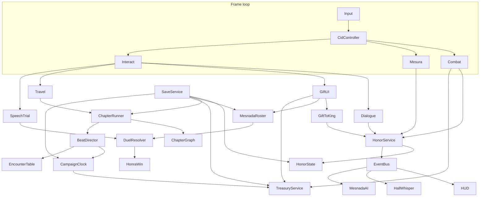
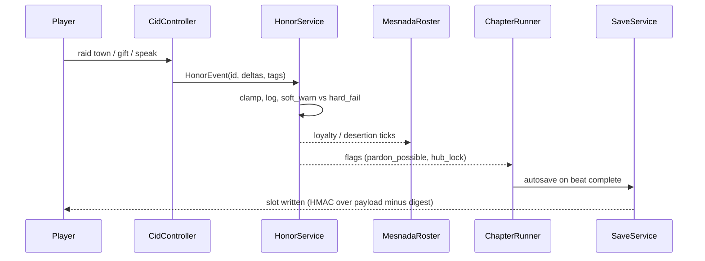
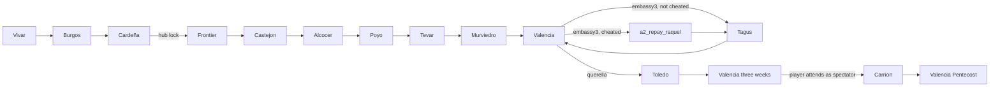
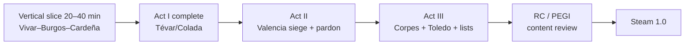
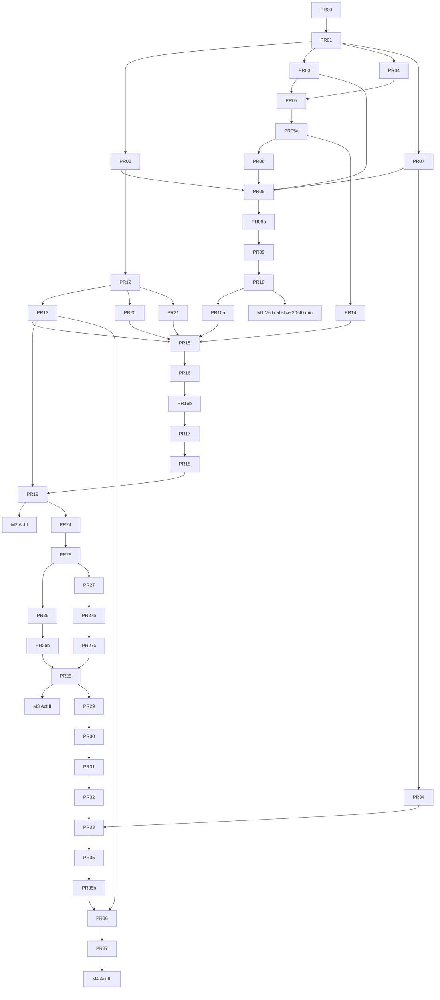

# Mio Cid

| Field | Value |
| --- | --- |
| Title | Mio Cid |
| Document type | Game Design Document + Technical Architecture |
| Author | TBD (design lead) |
| Date | 2026-08-31 |
| Status | Draft |
| Version | 0.3 |
| Project root | `/home/lqborges/mio-cid/` |
| Engine | Godot 4.7.x (pin 4.7.2 at bootstrap) |
| Target runtime | 15–18 hours, three acts |
| Platforms v1 | PC: Windows 10/11 and Linux (Steam). Steam Deck as stretch, not a v1 gate. |
| Rating target | PEGI 16 / ESRB M-equivalent for violence + non-sexual crime against adults |
| Language | Spanish VO first; English subtitles v1; UI bilingual |
| IP | Public-domain *Cantar de Mio Cid* (~3,730 verses). Not Puy du Fou. Not Heston 1961. Not Amazon *El Cid*. |

This document is the source of truth from which implementation PRs will be cut. There is no existing game codebase in `/home/lqborges`. GarminPaceCharts, gtd-*, and related worktrees are unrelated products. All paths below are for a **new** repository at `/home/lqborges/mio-cid/`.

---

## Overview

**Mio Cid** is a third-person action-RPG campaign of the anonymous Castilian epic *Cantar de Mio Cid*, paced as three juglar sessions: destierro, bodas, afrenta. The player is Rodrigo Díaz de Vivar as *their* Cid. The title is a mechanic: *mio* is possessive. The mesnada, Jimena, Elvira, Sol, and the burgaleses who whisper behind shutters are the name. Lose them and “Cid” is an empty epithet.

The poem is a double restoration of honor, not a Reconquista shooter and not a mercenary biography. Alfonso VI strips land; Rodrigo buys pardon with booty and gifts. The Infantes de Carrión steal family honor at the robledo de Corpes; Rodrigo sues; he wins in Toledo, then in the lists — and **he does not fight those lists**. Combat fills *onores*. Gifts to the king fill *honor*. Speech and *riepto* fill *honra*. Shipping only battles cuts the poem in half.

The proposed product is a **linear chaptered 3D action-RPG** on the Camino del Cid, built in Godot 4.7 by a **four-person** team, data-driven so designers can author beats without code. Closest comps for *feel*: *Ghost of Tsushima* (honor as a verb), *Kingdom Come: Deliverance* (dirt, law, horses that are animals), *Pentiment* (speech as combat, for Toledo). None of them are this story. Target: three acts, 15–18 hours of **authored corridors and hubs** (not open-world density), PEGI 16 because Corpes is a crime, not a battle. Runtime systems: `HonorService` and `SaveService` autoloads, `ChapterRunner` autoload holding a `ChapterGraph` Resource, `Treasury` for marks/horses, built-in Jolt Physics.

---

## Background & Motivation

### Why this game, why this text

The *Cantar* (copied by Per Abbat in 1207; surviving manuscript 14th c., BNE Vitr. 7-17) is already a game design document. It has a three-act structure (Menéndez Pidal’s division: vv. 1–1084 destierro, 1085–2277 bodas, 2278–3730 afrenta), a named party, two plot-item swords, a king you cannot kill, a Muslim ally you must keep, a legal climax, and a hero whose defining skill is *mesura* — waiting, speaking little, letting others strike.

Existing Cid products refuse that design:

| Product | What it does | Why it is not this game |
| --- | --- | --- |
| Puy du Fou España, *El Último Cantar* | Spectacle: rotating castle, flute-Babieca, arrow-in-chest Valencia, Espadero de Vivar, Nathan Stornetta score | Their IP. Cuts the lawsuit. Holy-war staging. |
| Anthony Mann / Charlton Heston (1961) | Hollywood romance + corpse strapped to Babieca | Later legend. Not the *Cantar*. |
| Amazon Prime *El Cid* | Dynastic TV, Jura de Santa Gadea, Jimena’s father | 13th–15th c. inventions. |
| Historical Ruy (Zaragoza, two exiles) | Mercenary biography 1081–1099 | A different game, to be called *Ruy* if ever made. |

Alberto Montaner Frutos’s Camino del Cid synopsis is the campaign bible: the *Cantar* is a literary work, not a document; the Corpes marriages have no historical foundation; there is no crusade ideal; honor has a material dimension (lifestyle, booty) and a reputational one (what equals say). Pavlovic’s meters map onto the three cantares and **must appear as playable gauges**, not flavor text.

### Current state

Greenfield. No engine project, no assets, no prior Cid code. The only “existing architecture” is this document and the public-domain poem.

### Pain this product exists to solve

Players who want the *Cantar* currently get either a park show, a 1961 corpse-horse, or a TV saga of invented oaths. There is no 15-hour game in which (1) you feed a warband by taking and *selling* towns, (2) you buy a king’s pardon with gifts you cannot keep, (3) your daughters are assaulted off-screen and you restore the name by lawsuit and by the men you raised. That third act is the game. Acts I–II exist so it hurts.

### Audience and session model

- Primary: players of narrative action-RPGs, 25–50, comfortable with subtitles, interested in medieval Iberia without wanting a lecture.
- Secondary: Spanish-language players who know the school *Cantar* and will notice if we fake it.
- Session length: 45–90 minutes, matching a juglar *tirada* cluster. Three acts ≈ three evenings, or one long weekend.
- Not a live-service, not a 60-hour map, not a multiplayer bannerlord clone.

---

## Goals & Non-Goals

### Goals

1. Deliver a **complete three-cantar campaign** in 15–18 hours, with Act I destierro ~6.5h, Act II bodas ~5.5h, Act III afrenta ~5h (including Toledo + spectator lists).
2. Implement **three honor meters** (`onores`, `honor`, `honra`) as code with sources, sinks, UI, and failure states. Combat, gifts, and speech each own a meter.
3. Treat the **mesnada as named knights**, not an RTS blob. Loyalty tracks gifts *to them*. Act III lists are fought by those knights; a poor lord loses.
4. Keep **source beat order** of Act I locked (Vivar → Burgos → sand chests → Cardeña → Gabriel → Castejón → Alcocer → first embassy → El Poyo → Tévar/Colada).
5. Ship a **vertical slice first**: short Vivar prologue → Burgos shutters → sand chests → Cardeña farewell. **20–40 minutes**, playable from a main menu with save/load and fail-copy. This is PR-mergeable content, not a trailer.
6. **Spanish VO** with poem formulas in the UI (`¡Ya, mio Cid, en buen ora cinxiestes espada!`). English subtitles v1.
7. **PEGI 16 honesty** on Corpes: a crime scene the player does not witness as a participant; no torture-porn camera; no skip that erases the fact.
8. **Public-domain IP only.** No Puy du Fou staging, no Stornetta-adjacent score, no flute-Babieca, no rotating castle, no Espadero de Vivar.
9. **PC v1** (Windows + Linux Steam), 30 fps minimum on the **min-spec** machine (see Platforms), 60 fps on recommended. Offline, single-player.
10. **Designer-authorable beats**: a new chapter node (dialogue, encounter table, blocking) requires data + scenes, not a programmer.
11. Staff and ship on a **four-person, ~18-month** calendar (see Staff, calendar, and v1 cut line). Greybox-first. Scripted large battles. Optional raids are cut from v1.

### Non-goals (locked)

| Cut | Why |
| --- | --- |
| Jura de Santa Gadea | 13th c. invention. A vassal does not make a king swear. |
| Duel with Jimena’s father | 14th–15th c. romance. *Cantar* Jimena is already his wife. |
| Dead Cid strapped to Babieca | Heston / later legend. Poem’s last line is Pentecost, then death. **No corpse on Babieca.** |
| Holy-war Spain | *Parias* from Muslims, sells towns back, Avengalvón is kin. Bishopric of Jerónimo is administration, not crusade. |
| Open-world Iberia | The Camino is the map. Linear chapters with hubs. |
| Puy du Fou staging | Rotating castle, flute-Babieca, arrow-in-chest Valencia, Espadero de Vivar, Stornetta score — their IP. |
| Historical-Ruy as spine | Zaragoza mercenary, two exiles = a different game called *Ruy*. |
| Player fighting the Carrión duels | The joke and the thesis: the mesnada you built fights. You sit in Valencia / sit the lists as lord. |
| Always-online, live-ops, battle pass | Single-player campaign. |
| Consoles in v1 | Non-goal. Input and save should not preclude later ports. |
| Character creator / gender-lock break | You are Rodrigo. Jimena, Elvira, Sol are not player-avatars. |
| Crafting trees, cooking minigames, hunting for pelts | KCD-adjacent dirt is welcome; busywork is not. Feed the mesnada from booty and towns, not rabbit traps. |
| New Game+ loot ladder | Swords are plot items. Colada and Tizona are not drops. |
| Optional Act I extra raids | Cut from v1. Encounter tables may ship off, but they are not in the 15–18h budget. |
| Mixamo hero | Look: 11th-c. Iberian kit, not marketplace modern-athletic. Mixamo is allowed only as a **temp** animation stand-in in `_dev/`, never in shipped hero. |
| C# runtime | GDScript only in `game/`. Tools are Python. No C# assemblies. |

### Staff, calendar, and v1 cut line

Intended team: **four people**.

| Seat | Owns |
| --- | --- |
| Gameplay programmer | Godot systems, combat, save, CI, DuelResolver |
| Narrative designer / writer | Beats, dialogue, honor events, loc keys, SpeechTrial content |
| 3D generalist | Greybox → kitbash → hero/location art, AnimationTree |
| Audio (0.5) + composer (contract) | Spanish VO direction, buses, vihuela score |

Calendar to 1.0 (**~18 months** after M0):

| Milestone | Duration | Date-shape (from 2026-09 bootstrap) |
| --- | --- | --- |
| M0 Bootstrap | 2 weeks | repo, CI, Jolt project setting, gdUnit4 |
| M1 Vertical slice | 8 weeks | 20–40 min Vivar→Cardeña, meters, treasury, menu |
| M2 Act I | 5 months | destierro through Tévar/Colada; simple cavalry |
| M3 Act II | 4 months | Valencia hub, 8 siege events, Yusuf day-1 playable / day-2 scripted |
| M4 Act III | 4 months | Corpes packet, Toledo, spectator lists, Pentecost |
| M5 Ship | 3 months | loc, 30 fps min-spec, Steam Windows+Linux, rating submission |

**How 15–18h is earned without an open world:** authored Camino corridors (90 s–3 min, skippable on repeat), hub conversations, siege as a calendar of 8 events, speech in Toledo, spectator lists. Not combat-hours. If art slips, **shorten corridors and siege rest-skips**, do not cut Corpes/Toledo/lists.

**v1 cut list (preserves thesis):**

- Optional Poyo extra raids: **off**.
- Yusuf day 2: **scripted battle-cinematic** with one player charge, not a second full encounter director.
- Siege: **8** authored events, not a range.
- Corridors: **90 s–3 min**, not 8 min.
- Horse: **greybox companion** with walk/trot/canter/couch; no cinematic hair-physics; unnamed in destierro, called Babieca from Valencia onward (legend, not a flute).
- Crowd: 24 skinned + impostors; HUD `lanzas` count does the poem’s hundreds.
- Combat-content PRs are split (sortie ≠ booty UI; Yusuf day 1 ≠ day 2).

---

## Source Fidelity & Campaign Bible

**Bible, in this order of authority:**

1. This GDD’s locked beat lists (below).
2. Alberto Montaner Frutos, plot synopsis, Consorcio Camino del Cid.
3. Menéndez Pidal three-cantar structure (verse ranges above).
4. Poem formulas for UI/VO (Montaner edition preferred at implementation; Pidal acceptable for familiar lines).
5. Historical *Historia Roderici* / real 1081–1099 biography: **reference color only**. Never the spine.

The *Cantar* is literature. Corpes marriages have no historical basis. That is a feature: Act III is the invented wound the poem exists to heal.

### Three meters (must actually show)

| Cantar | Meter (internal id) | Meaning in play | Primary verb |
| --- | --- | --- | --- |
| Destierro | `onores` | Fiefs, booty, right to feed a warband | Raid, take, sell, gift *down* to the mesnada |
| Bodas | `honor` | Rank, royal pardon, a city | Gift *up* to Alfonso, hold Valencia, accept the king’s ask |
| Afrenta | `honra` | Name. What people say when you enter a hall | Speech, *riepto*, mesura, not riding to Carrión with a host |

UI never translates these as a single English “Honor” bar. English subtitles may gloss (`onores` → “means / fiefs”; `honor` → “standing with the king”; `honra` → “name”) but the meters stay distinct.

### Act I — Cantar del destierro (do not reorder)

Play fantasy: *Mount & Blade* on a road. Mesnada starts at a dozen. Every raid: **keep the town** (fame, Alfonso’s wrath) or **sell it** (gold, mobility).

| Beat id | Location | Mandatory events | Player verbs |
| --- | --- | --- | --- |
| `a1_vivar` | Vivar | House empty, chests gone, exile clock (nine days in poem; game: a visible *plazo* bar to the frontier) | Walk the empty solar, call the first names |
| `a1_burgos` | Burgos | Shutters. Child and **Montaner v. 20**: *«Dios, qué buen vassallo, si oviesse buen señor»*. (v. 9 is the Vivar departure formula, not this line.) No lodging. Camp on the river like outlaws. | Do **not** storm the inn. Mesura check if player draws steel on burgaleses. |
| `a1_arcas` | Burgos judería / river camp | **Sand chests** with Martín Antolínez / Raquel y Vidas. First honor crime the poem allows. | Accept cheat (gold, small `honra` stain, men stay) or refuse (watch desertion) |
| `a1_cardena` | San Pedro de Cardeña | Jimena, Elvira, Sol. *Como la uña de la carne.* Abbot Sisebuto. **Hub lock: cannot return** after farewell. | Gift to the monastery, embrace, leave. Save checkpoint `hub_lock_cardena`. |
| `a1_navapalos` | Frontier / Figueruela | Dream of Gabriel. “While you live you will succeed.” | Sleep. No combat. |
| `a1_castejon` | Castejón de Henares | Dawn take. Toledo is Alfonso’s protectorate: **stay and he kills you** (game over / forced sell). Álvar Fáñez sacks down the Henares. | Take, loot, **sell**. Keep = Alfonso wrath event, lose. |
| `a1_alcocer` | Alcocer | Occupy, wait, **dawn sortie** vs Fáriz and Galve. Then sell it again. | Siege-lite, sortie, distribute booty, gift to Álvar |
| `a1_embassy1` | Road / Alfonso off-map | Álvar Fáñez takes a gift to the king. Minaya’s lands restored; Cid not yet pardoned; recruitment flood allowed. | Choose gift bundle. This is `honor` income. |
| `a1_poyo` | El Poyo del Cid | Camp becomes a place-name. | Optional rest hub. No return to Cardeña. |
| `a1_tevar` | Pinar de Tévar | Count of Barcelona (Ramón Berenguer / *don Remont*). Capture. Hunger strike. Make him eat at your table. Keep **Colada**. | Battle, then table scene. Colada is a plot item, not loot. |

**Act I failure states:** 3 consecutive `camp_unfed` nights → desertion cascade among `desertion_capable` captains → if living named captains still with you `< 4`, campaign fail (“the name is empty”). Worked numbers are in the economy appendix. Keeping Castejón (`alfonso_protectorate`) is an immediate hard fail. Keeping Alcocer past `sell_deadline_days` fires `alcocer_keep` then Alfonso’s host (hard fail). Killing burgaleses in Burgos → `honra` crash, later halls refuse you.

### Act II — Cantar de las bodas

Verb changes: stop raiding; **take a city to live in**. Valencia is the only real hub.

| Beat id | Location | Mandatory events | Player verbs |
| --- | --- | --- | --- |
| `a2_murviedro` | Murviedro (Sagunto) | Isolate Valencia | Field battle, cut roads |
| `a2_siege` | Valencia | **Nine-month siege**: starvation, not a single storming. Calendar of attrition events. | Manage food, sallies, parley, *parias*. No hero-climb of the wall. |
| `a2_jeronimo` | Valencia | Bishopric of Jerónimo. Mosque → cathedral as administration. Jerónimo wants to fight. | Appoint, gift, let him take a lance |
| `a2_embassy2` | Valencia → Alfonso | Second gift. Jimena and girls ride from Cardeña via Medinaceli with **Avengalvón**. Keep him. Proof this is not a holy war. | Escort is a chapter, not a cutscene-only. Avengalvón is recruitable and **essential**. |
| `a2_yusuf` | Valencia huerta / wall | Yusuf of Morocco, two-day battle, Jimena watching from the wall. | Two-day battle structure. Jimena is spectator-NPC on the wall. |
| `a2_embassy3` | Valencia → Alfonso | Third gift. Pardon becomes possible. | Gift bundle (`data/gifts/embassy_3.json`). Required before Tagus. Sets `embassy3_done`. |
| `a2_repay_raquel` | Valencia hub | **AND-join before Tagus if cheated.** Incoming edge is **only** from `a2_embassy3` when `arcas_cheated`. Raquel and Vidas approach Minaya; Cid **must** repay. If not cheated, this node is unreachable. | Pay (stain cleared, `honra` +8, `repay_done`). Only option. |
| `a2_tagus` | Tagus / Toledo marches | Alfonso pardons you. Three-day court. He asks the marriages. You do not want them. You say yes because he is the king. | Speech. Refusing the marriages **breaks the pardon** (v1: you cannot refuse). **Graph AND-join:** `a2_embassy3` → `a2_tagus` if `!arcas_cheated`; `a2_embassy3` → `a2_repay_raquel` if `arcas_cheated`; `a2_repay_raquel` → `a2_tagus` (`repay_done`). Cheated save **cannot** open Tagus without `repay_done` (CI fixture). |
| `a2_bodas` | Valencia | Infantes arrive as “allies” with terrible combat stats and high birth. Court, forge, mesnada hall, **lion cage**. Player can see the disaster. Cannot stop it without breaking the pardon. | Train them (they will not improve enough). Gift them. Watch. |

**Valencia hub rooms (persistent):** mesnada hall, chapel/bishopric, forge, wall walk, Jimena’s solar, lion cage, treasury. No open-world kingdom layer.

### Act III — Cantar de la afrenta de Corpes

This is the game. Acts I–II exist so this one hurts.

| Beat id | Location | Mandatory events | Player verbs |
| --- | --- | --- | --- |
| `a3_leon` | Valencia hall | Lion escapes. Rodrigo asleep. Men ring him. Infantes hide. He puts the lion back. Infantes have no mesura. That is the joke. | Scripted. Player may choose how gently to return the lion. Rage dump here costs `honra`. |
| `a3_bucar` | Valencia shore | Búcar. Infantes flee; captains cover; **Tizona** from this fight. | Battle. Tizona is a plot item. Infantes’ cowardice is recorded as `InfanteCowardice` flags. |
| `a3_despedida` | Valencia | Infantes leave with daughters, swords as gifts. Try to murder Avengalvón on the road. He lets them go. | Gift Colada and Tizona (forced by plot once you agree to the departure). Avengalvón scene is playable; **he must survive**. |
| `a3_corpes` | Valencia hall → (optional cinematic) Robledo de Corpes aftermath | Crime happens **off-stage**. Player is in Valencia. Félez Muñoz finds them. See [Corpes beat script](#corpes-beat-script). | Aftermath only. Two accessibility branches; fact cannot be skipped. |
| `a3_querella` | Valencia | Player does **not** ride to Carrión with a host. Send Muño Gustioz to Alfonso with a *querella*. | One-ask `SpeechTrial` (`querella_dictate`). Riding with a host is a red option that tanks `honra` and is blocked from completing the legal win. |
| `a3_toledo` | Cortes de Toledo | Three asks, **this order** (the poem’s joke): (1) return Colada and Tizona — they smile, done; (2) return the 3,000-mark dowry — they have spent it, humiliation; (3) the *afrenta*. *Riepto.* Navarre/Aragón ask (not a skill check). | Speech combat. See Toledo system. |
| `a3_valencia_wait` | Valencia hub | Three weeks on `CampaignClock` while champions ride. Jimena rest. | No combat. Autosave. |
| `a3_carrion` | Lists of Carrión | Three duels: **Pero Bermúdez** vs Ferrán González (Tizona in Pero’s hand); **Martín Antolínez** vs Diego González (Colada); **Muño Gustioz** vs Asur González. **Player attends as spectator.** Cid’s body is **not a hurtbox and not a possessable pawn**. | One shout per duel (`shout_silence` / `shout_once` / `shout_too_much`). Outcomes from `DuelResolver`. |
| `a3_pentecost` | Valencia | Navarre and Aragón ask for the girls during the same cortes. Poem ends at Pentecost. He dies. **No corpse on Babieca.** | Epilogue. Credits over Pentecost, not a last charge. |

Navarre/Aragón embassy is a Toledo-same-week beat, not a new war.

---

## Proposed Design

### 1. Engine recommendation

**Pick: Godot 4.7.x, Forward+ renderer, GDScript-only in `game/`, Python tools.**

Pin at bootstrap: Godot **4.7.2** (current stable as of 2026-08). Upgrade only on a dedicated PR after a playtest of the vertical slice.

| Criterion | Godot 4.7 | Unity 6 | Unreal 5 |
| --- | --- | --- | --- |
| License / cost | MIT, no per-seat, no runtime fee | Seat + possible runtime | Seat; source access heavier |
| Small-team 15–18h narrative 3D | Strong: scenes, Resources, Dialogue Manager 4.x, cheap iteration | Strong: talent pool, animation | Strong rendering; heavy for this scope |
| Linux + Steam Deck export | First-class | Extra work | Extra work |
| 3D third-person action | Adequate with AnimationTree, CharacterBody3D, Jolt physics | Excellent | Excellent |
| Terrain for a *road*, not a continent | HeightMap + GridMap + streamed chapter scenes | Terrain tools better | World Partition overkill |
| Dialogue / localization | CSV; nathanhoad Dialogue Manager **4.x** (Godot 4.6+) | Yarn Spinner mature | Dialogue plugins, heavier |
| Horse animation | Hard on all three. Godot is not worse if we scope horse as companion + limited gait set | Better marketplace horses | Best out of box, still a year of work |
| Hireability | Smaller 3D talent pool | Largest | Cinematic talent |
| Risk for *this* game | Rendering ceiling, horse, large battles | License/cost, C# vs designer scripts | Overkill, cinematic temptation to become Puy du Fou |

**Rationale:** a small team building a 15–18h *narrative* action-RPG should optimize for iteration on dialogue, meters, chapter graph, and mesnada data — not nanite forests. Godot’s `Resource` pipeline is the right authoring grain. MIT license matches a public-domain text. Native Linux matters: this repo lives on Linux and v1 ships Linux. Unreal’s cinematic tools are a *risk* for this IP (they pull toward park spectacle). Unity is the honest second choice if we cannot hire a Godot 3D generalist within 90 days of bootstrap (see Open Questions).

#### Engine subsystems — how we use them

| Need | Godot 4.7 choice | Notes |
| --- | --- | --- |
| Rendering | Forward+, clustered lights, SDFGI **off** outdoors, lightmaps for halls | 1080p target. Valencia siege uses baked probes + a few realtime torches. |
| Animation | `AnimationTree` (blend spaces for locomotion, state machine for attacks) + `SkeletonIK3D` for look-at / sword plant | Shared humanoid skeleton (`Armature_mio_cid_v1`). Mixamo look is wrong for an 11th-c. Castilian; temp clips only in `content/art/_dev/`. Shipped hero: paid 11th-c. kit or in-house. |
| Terrain | Per-chapter `GridMap` + sculpted `MeshInstance3D` hero path; no planet-sized terrain | Camino is a sequence of **400–1200 m** greybox corridors (90 s–3 min play), not Iberia. |
| Physics | **Built-in Jolt Physics** (`physics/3d/physics_engine="Jolt Physics"` in `project.godot`) | Built-in since Godot 4.4; 4.7.2 new projects default to Jolt. Do **not** vendor `godot-jolt` (addon supports 4.3–4.6 only). Docs: Godot “Using Jolt Physics”. Cavalry/`CharacterBody3D` needs no extension joints. |
| Navigation | `NavigationRegion3D` baked per chapter | Mesnada follows the road and forms a wedge. |
| Dialogue | nathanhoad Dialogue Manager **v4.0.x** (pin git tag at PR-07; Godot 4.6+) + `SpeechTrial` for Toledo/querella | Ink is overkill; Yarn is extra runtime. Lines live in `content/chapters/<id>/*.dialogue`; displayed text is CSV keys. |
| Save | `SaveService` → compressed JSON + HMAC-SHA256 in `user://saves/` | HMAC over canonical payload **excluding** the digest field. See Security. |
| Localization | Godot CSV (`res://content/locales/strings.csv`) + Dialogue Manager locale keys | `es` default audio; `en` subtitles required v1. Poem formulas are rows, not hardcoded. |
| Audio | `AudioStreamPlayer` + tagged buses (VO, SFX, Music, Ambience, UI) | Wwise/FMOD **not** in v1. |
| UI | Control scenes + custom `HonorMeters` widget | Theme: parchment/iron, not sci-fi bars. Act I also shows `plazo` next to the three meters. |
| Cutscenes | `AnimationPlayer` on cameras + Dialogue Manager timelines. No full Sequencer clone. | Lion, Gabriel, Corpes aftermath, Pentecost. |
| CI | Headless Godot `--import` + **gdUnit4** on GitHub Actions | Linux runner. Pin gdUnit4 to a 4.7-compatible tag in `addons/gdUnit4/` at PR-00. Not GUT. |
| Data import | `tools/import_*.py` is the **only** author of `.tres` from JSON | CI runs import. EditorPlugin is a thin button that shells the same scripts. No parallel hand-authored `.tres`. |

**Performance and hardware (one table).** Min spec **is** the 30 fps budget machine.

| Class | GPU / RAM | Resolution | Min fps | Target fps | Settings |
| --- | --- | --- | --- | --- | --- |
| **Min spec** (30 fps budget) | GTX 1660 / RX 580, **16 GB** RAM, 4-core CPU, Vulkan 1.2 | 1080p | **30** | 40 | Medium: **2** shadow cascades, **4** shadow-casting lights, no SDFGI, 24 skinned + LOD |
| Recommended | RTX 3060 / RX 6600, 16 GB | 1080p | 45 | **60** | High: 4 cascades, 6 shadow-casting lights |
| Steam Deck (stretch, not a v1 gate) | Deck APU, 16 GB shared | **800p** | 30 | 40 | Low: 1 cascade, 2 shadow-casting lights |

Draw budget on min spec: **≤ 4** realtime shadow-casting lights, **2** cascades, ≤ **24** skinned meshes in combat (player + 8 named + ~12 LOD), impostors beyond 25 m, ≤ 1.5M triangles typical chapter. Valencia wall crowd is impostors. Do not ship 50 full-skin actors on min spec.

**Install size:** VO 1.2–1.8 GB (compress); textures/meshes 6–8 GB (2K cap on min, 4K optional); engine+code < 0.5 GB. **Install cap 16 GB.** Raise the old 12 GB claim; it did not fit VO + art.

**Why not 4.3 / 4.5:** 4.4 is already EOL (Mar 2026). 4.6 and 4.7 are in active support. Pin 4.7.2; do not ride nightlies.

### 2. Repo / project layout

```
/home/lqborges/mio-cid/
├── README.md
├── AGENTS.md                          # contributor rules; engine pin; no Puy du Fou
├── LICENSE                            # MIT for code; content license note for VO
├── project.godot                      # Godot project lives at repo root
├── export_presets.cfg
├── .gitignore                         # .godot/, *.translation binaries, user://
├── addons/
│   ├── dialogue_manager/              # pin v4.0.x tag
│   └── gdUnit4/                       # pin 4.7-compatible tag; not GUT
├── game/                              # runtime code (GDScript)
│   ├── autoload/
│   │   ├── event_bus.gd               # the only signal hub
│   │   ├── honor_service.gd           # owns HonorState Resource
│   │   ├── save_service.gd
│   │   ├── chapter_runner.gd          # Node; holds ChapterGraph Resource
│   │   ├── campaign_clock.gd
│   │   ├── treasury_service.gd        # owns Treasury Resource
│   │   ├── game_state.gd              # thin facade: getters only
│   │   ├── audio_service.gd
│   │   ├── loc.gd
│   │   └── debug_overlay.gd
│   ├── actors/
│   │   ├── player/
│   │   │   ├── cid_controller.gd
│   │   │   ├── cid_combat.gd
│   │   │   ├── mesura_component.gd
│   │   │   └── horse_companion.gd     # v1 companion; unnamed until Valencia
│   │   ├── mesnada/
│   │   │   ├── mesnada_member.gd
│   │   │   ├── mesnada_ai.gd
│   │   │   └── mesnada_roster.gd
│   │   └── npc/
│   ├── combat/
│   │   ├── hit_box.gd
│   │   ├── hurt_box.gd
│   │   ├── weapon_moveset.gd
│   │   ├── cavalry_charge.gd
│   │   └── duel_resolver.gd           # Act III lists
│   ├── systems/
│   │   ├── honor/
│   │   ├── inventory/
│   │   ├── gifts/
│   │   ├── siege/
│   │   ├── travel/
│   │   ├── speech/
│   │   ├── economy/                   # Treasury, booty divide, feed
│   │   └── time/                      # CampaignClock (also autoloaded)
│   ├── chapters/
│   │   ├── chapter_graph.gd           # Resource, not an autoload
│   │   └── beat_director.gd
│   ├── ui/
│   │   ├── hud/
│   │   ├── honor_meters.tscn
│   │   ├── hall_whisper.tscn
│   │   ├── speech_trial.tscn
│   │   ├── embassy_ledger.tscn
│   │   └── pause/
│   └── util/
├── content/                           # authored, not code
│   ├── chapters/                      # one folder per beat id
│   │   ├── a1_vivar/
│   │   ├── a1_burgos/
│   │   ├── a1_arcas/
│   │   ├── a1_cardena/
│   │   └── ...
│   ├── characters/
│   ├── locales/
│   │   ├── strings.csv
│   │   └── poem_formulas.csv
│   ├── audio/
│   │   ├── vo/es/
│   │   ├── sfx/
│   │   └── music/
│   ├── art/
│   │   ├── characters/
│   │   ├── locations/
│   │   ├── items/
│   │   └── ui/
│   └── cinematics/
├── data/                              # JSON + .tres Resources
│   ├── schema/                        # JSON Schema drafts
│   ├── characters/
│   ├── items/
│   ├── honor_events/
│   ├── gifts/
│   ├── economy.json                   # feed, booty fractions, horse=marks
│   ├── difficulty/
│   ├── mesnada/
│   ├── chapters/
│   │   └── graph.json
│   ├── clocks/
│   └── encounters/
├── docs/
│   ├── gdd.md                         # copy of this document
│   ├── style-guide.md
│   ├── content-rating-corpes.md
│   └── telemetry.md
├── tests/
│   ├── unit/
│   └── playtest/
├── tools/
│   ├── import_characters.py
│   ├── validate_graph.py
│   └── loc_lint.py
└── .github/workflows/
    ├── import-and-test.yml
    └── export-linux.yml
```

Godot `res://` maps to the repo root. `game/` is code; `content/` is art and **per-chapter** `.dialogue` files; `data/` is tunables. Designers never put numbers in GDScript.

**Autoload list (Nodes only):** `EventBus`, `HonorService`, `SaveService`, `ChapterRunner`, `CampaignClock`, `TreasuryService`, `GameState`, `AudioService`, `Loc`, `DebugOverlay` (debug builds). `ChapterGraph`, `HonorState`, `Treasury` are Resources held by those nodes. `GameState` is a **thin facade** (`honor()`, `treasury()`, `roster()`, `flags()`, `clock()`, `chapter_id()`) so UI does not reach into four services. It does not store state. `EventBus` is the only signal hub; services emit through it.

### 3. Core loops and system architecture





**Core loop, Act I (every 20–40 minutes):** travel a Camino corridor → scout a place → take it at dawn or by parley → **keep or sell** → divide booty into `Treasury` (quinto escrow / mesnada gifts / remainder) → `onores` event from the take/sell → camp (`CampaignClock` night: **feed spends marks**, unpaid feed is an `HonorEvent` sink on `onores`) → next beat.

**Core loop, Act II:** hold Valencia → run siege calendar or court day → send embassy → survive Yusuf → accept marriages.

**Core loop, Act III:** witness cowardice → lose swords and daughters → receive Corpes news → file *querella* → win Toledo by speech → win Carrión by proxy.

**Player controller (v1 spec):**

- Camera: third-person, right-stick / mouse orbit, lock-on *soft* (target bias, not Souls hard lock). Default to battlefield awareness, not duel tunnel.
- Locomotion: walk / run / sprint (sprint drains `stamina`, not `honra`). Crouch only for Castejón dawn crawl.
- Mount: **v1 companion horse is on.** Unnamed in destierro; named Babieca from Valencia hub onward. Hold interact to mount. Horse is an actor with stamina and fear, not a motorcycle. Greybox gait set (walk/trot/canter/couch) is required before Castejón. Travel still uses short scripted camera rides in corridors.
- Interact: context prompt (talk, gift, open, mount, plant banner).
- Mesura button: **hold** to wait / lower weapon / refuse the rage dump. This is the skill tree’s first node.
- Death: player HP ≤ 0 → fail presentation “the name is empty” variant `you_fell` → reload last beat autosave. Captains use the same reload if `essential`. Unkillable characters have no hurtbox.

**Time:** one `CampaignClock` autoload. Default **paused** (chapter-local scenes do not tick hours).

**Feed is not “every night on the clock.”** Mouth-cost runs only in `CAMP_NIGHT` and `REFUSE_48H`. Plazo is an independent HUD countdown (`plazo_days_left`), **not** a feeding segment. It can stay visible while `segment == CAMP_NIGHT` (Burgos river camp still inside the nine-day exile). Vivar rest-skips call `advance_plazo(1)` and never `camp_night()`.

| Segment | Advances | Feeds mouths? | Used by |
| --- | --- | --- | --- |
| `PAUSED` | nothing | no | Default; Vivar walk; halls |
| `CAMP_NIGHT` | 1 night per rest | **yes** | River camp, Cardeña night, Alcocer wait, Poyo |
| `REFUSE_48H` | 2 nights after `arcas_refuse` | **yes** | Road after refuse (unnamed leave) |
| `SIEGE` | 1 siege-day; rest-skip 14–28 days | **no** | Valencia calendar. Authored siege events may fire a one-shot `camp_unfed` if the event says so |
| `LISTS_WAIT` | 21 days, skippable rest | **no** | `a3_valencia_wait` (city stores feed the hall) |

`plazo_days_left` (start 9): decrement via `advance_plazo(n)` on beat-complete (Vivar, Burgos, Cardeña, Navapalos) or a dedicated plazo rest. Hitting 0 before Navapalos is `hard_fail` `plazo_expired` (Alfonso’s nine days). Hidden after `a1_navapalos`. **Never** routed through `TreasuryService.camp_night()`.

Save stores `clock: { segment, days_elapsed, unfed_streak, plazo_days_left }`. `unfed_streak` lives **only** here (not on `HonorState`). `HonorService` reads `CampaignClock.unfed_streak` for the name-empty fail. Siege is a view of this clock in `SIEGE`, not a second system.

### 4. Map and travel

Not open-world Iberia. The map **is** the Camino del Cid:

`Vivar – Burgos – Cardeña – Alcarria/Henares – Jalón – Jiloca – Tévar – Murviedro – Valencia – Toledo – Carrión`



Each node is a **chapter scene** (`content/chapters/<beat_id>/world.tscn`) plus a **corridor** if the poem rides between them. Corridors are **90 s–3 min** authored roads with 0–1 colour encounter, skippable after first completion (accessibility). Fast travel unlocks only backward within an open hub (Valencia) or to last camp, never past `hub_lock_cardena`. Optional extra raids are **v1-cut**.

World scale: 1 game-meter = 1 meter. Towns are representative, not cadastral. Burgos is one street + river + judería + shuttered square, not the modern city.

### 5. Feature flags

```
flags.horse_companion        # ON in v1 (greybox gaits). Named Babieca from Valencia.
flags.chapter.a1_vivar
flags.chapter.a1_burgos
...
flags.speech_trial           # Toledo
flags.duel_spectator         # Carrión lists; player not possessable
flags.sandbox_raids          # OFF in v1
flags.telemetry_opt_in       # OFF default; first-party HTTPS only
```

A chapter flag off = graph edge missing; saves from that chapter still load. Rollback = load previous chapter autosave.

---

## Honor System as Code

Three meters, never collapsed. Internally 0–100 float. UI shows discrete poem language, not “87/100”.

### State

See `HonorState` in [API / Interface Changes](#api--interface-changes). Summary:

| Meter | Floor | Soft fail (`soft_warn`) | Hard fail (`hard_fail`) | UI |
| --- | --- | --- | --- | --- |
| `onores` | 0 | Cannot recruit; hunger whisper | 3 consecutive `camp_unfed` **and** living named captains `< 4` | Chest + “mouths you can feed tonight” (marks ÷ 8) |
| `honor` | 0 | Embassies ignored; pardon clock frozen | `alfonso_wrath` while occupying a town with `keep_past_deadline_fail` | Embassy ledger + royal favor phrases |
| `honra` | 0 | Halls go silent; Infantes mock; duel morale − | Lists: all three champions `will_swear_riepto=false` **and** no substitute | Hall-whisper ticker + formula in HUD |

`HonorService` emits **two signals**: `soft_warn` (HUD) and `hard_fail` (fail screen). Do not collapse them.

Start of game: `onores=8`, `honor=15` (you *were* a vassal), `honra=40` (name known, land stripped). Destierro is not “honor = 0”; it is *onores* stripped. Treasury starts at **0 marks, 2 horses** (the road, not a fortune).

### Economy appendix (marks, booty, `onores`)

Three numbers that must not be confused:

| Name | Type | What it is |
| --- | --- | --- |
| **Mark** | `Treasury.marks: int` | Silver. The poem’s *marco*. Currency for feed, monastery gifts, dowry, repayment. |
| **Horse** | `Treasury.horses: int` | Animals. Commute **1 horse = 10 marks** (`data/economy.json` `horse_marks`). Embassy “thirty horses” spends **30 horses**, not 30 marks. |
| **`onores`** | meter 0–100 | The *right to feed a warband* as a social fact (fiefs, booty, a chest the men can see). **Not** spent to eat. Eating spends **marks**. Unpaid eating **sinks** `onores`. |

`data/economy.json` (designers edit this; no literals in GDScript):

```json
{
  "feed_marks_per_mouth": 8,
  "horse_marks": 10,
  "quinto_fraction": 0.2,
  "mesnada_fraction": 0.4,
  "treasury_fraction": 0.4,
  "camp_fed_onores": 1,
  "camp_unfed_onores": -8,
  "camp_unfed_loyalty": -0.20,
  "unfed_lanzas_base": 1,
  "unfed_lanzas_per_50_marks_short": 1,
  "unfed_streak_hard": 3,
  "named_captains_fail_below": 4,
  "mouths": "lanzas + living_named_captains",
  "horses_follow_fractions": true,
  "horses_all_to_treasury": false
}
```

**Booty → marks vs `onores`:** a beat’s `BootyPile` (`marks`, `horses`, `cloth`, `arms`) is divided by `TownHolding.divide(pile, treasury, roster)`. **Horses follow the same fractions** (`horses_follow_fractions: true`). Not `horses_all_to_treasury`.

1. `quinto` (0.2) → `Treasury.royal_escrow_marks` and `Treasury.royal_escrow_horses`.
2. `mesnada` (0.4) → marks and horses as gifts-down (loyalty). Those horses **leave the player herd**.
3. Rest (0.4) → `Treasury.marks` / `.horses`.
4. Then fire the beat’s `HonorEvent` (`castejon_take`, `castejon_sell`, …). That event is the **only** `onores` change from the raid. Selling is a second pile + second event.

`test_camp_night.gd` / booty fixtures use these numbers, not “all horses to the player.”

**Camp-night feed is an HonorEvent, not a hidden formula.** `CampaignClock` calls `TreasuryService.camp_night()` **only** when `segment` is `CAMP_NIGHT` or `REFUSE_48H`:

```
mouths = lanzas + living_named_captains
cost = mouths * feed_marks_per_mouth
if treasury.marks >= cost:
    treasury.marks -= cost
    HonorEvent camp_fed
else:
    shortfall = cost - treasury.marks
    treasury.marks = 0
    HonorEvent camp_unfed
    lanzas -= unfed_lanzas_base + floor(shortfall / 50)
    roster.tick_starvation()   # desertion_capable only
    CampaignClock.unfed_streak += 1   # single owner
```
On `camp_fed`, `CampaignClock.unfed_streak = 0`.

Slaughtering a horse for meat: player choice at camp, `horses -= 1`, `marks += horse_marks`, still may fire `camp_fed` if that covers cost. UI copy: “Tonight we eat a horse.”

**Worked example — cheat through Castejón**

| Step | marks | horses | lanzas | mouths | onores | notes |
| --- | --- | --- | --- | --- | --- | --- |
| Vivar start | 0 | 2 | 12 | 17 | 8 | 5 named captains |
| `arcas_cheat` | 600 | 2 | 12 | 17 | 30 | +600 marks, +22 onores, −6 honra stain |
| River camp night | 464 | 2 | 12 | 17 | 31 | cost 17×8=136, `camp_fed` |
| Cardeña gift 40 | 424 | 2 | 12 | 17 | 31 | honra +4 |
| Castejón take pile 800m+40h | — | — | — | — | 45 | event +14; divide **same fractions**: marks escrow 160 / mesnada 320 / treasury +320 → marks 744; horses quinto 8 escrow / mesnada 16 (gifts, leave herd) / treasury +16 → **horses 18** (2+16) |
| Castejón sell +400m | 1144 | 18 | 12 | 17 | 55 | event +10; sell pile is marks-only |
| Embassy `ten_horses` | 1144 | 8 | — | — | honor +8 | 18 treasury horses; `thirty_horses` **blocked** until Alcocer/Poyo grows the herd. Escrow 8 horses go to Alfonso as part of later embassies, not this option |

Cheat-branch embassy 1 is `ten_horses` (affordable). `thirty_horses` is the post-Alcocer option. Fixtures in PR-05a / PR-16b match this table.

**Worked example — refuse through Castejón (real branch, not flavor)**

| Step | marks | horses | lanzas | onores | unfed_streak | notes |
| --- | --- | --- | --- | --- | --- | --- |
| Start | 0 | 2 | 12 | 8 | 0 | |
| `arcas_refuse` | 0 | 2 | 12 | 8 | 0 | honra +3 `kept_word`; **0 marks** |
| Night 1 river (unfed) | 0 | 2 | 9 | 0 | 1 | cost 136, shortfall 136, lose 1+2 lanzas; loyalty −0.20 |
| Night 2 road 48h | 0 | 1 | 6 | 0 | 2 | player may slaughter 1 horse (+10 marks, still unfed); 3–6 unnamed gone |
| If Night 3 before a take | 0 | 1 | 3 | 0 | 3 | two lowest-loyalty **desertion_capable** captains leave (Martín/Félez at 0.55−0.60=below 0.15). Living named captains = Álvar+Pero+Muño = 3 `< 4` → **hard fail** “the name is empty” |
| If they take Castejón on morning 3 | pile pays feed | — | 6 | 14 | 0 | streak resets on `camp_fed`. Harder fight: 6 lanzas, no Martín if he already walked. |

Refuse is therefore: **raid Castejón before the third unfed night**, with a thinner wedge. Not a flavour line. Embassy 1 on this branch: `ten_horses` (if they kept/sold enough animals) or `empty_hands` (honor −6) if horses < 10. `thirty_horses` is blocked when `horses < 30`.

`HonorService` does not convert marks to `onores` except through these events.

### Sources and sinks (data-driven)

Every change is one `HonorEvent` id in `data/honor_events/`. Schema is `deltas: {onores?, honor?, honra?}` plus optional `stain_id`, `clear_stain`, `flags_set`, `hard_fail`. **Plot swords are not honor events**; they live on `SwordItem`.

| id | deltas | tags | beat |
| --- | --- | --- | --- |
| `burgos_draw_steel` | honra −12 | `mesura_fail` | a1_burgos |
| `burgos_camp_river` | honra +2 | `mesura` | a1_burgos |
| `arcas_cheat` | onores +22, honra −6 | `allowed_crime`, stain `arcas_cheat` | a1_arcas |
| `arcas_refuse` | honra +3 | `kept_word`,`poverty` | a1_arcas |
| `camp_fed` | onores +1 | `feed` | any camp |
| `camp_unfed` | onores −8 | `feed`,`hunger` | any camp |
| `cardena_gift_monastery` | honra +4 | `gift_down` | a1_cardena |
| `castejon_take` | onores +14 | `raid` | a1_castejon |
| `castejon_sell` | onores +10 | `sell`,`mobility` | a1_castejon |
| `castejon_keep` | honor −40 | `alfonso_wrath`, **hard_fail** | a1_castejon |
| `alcocer_sortie_win` | onores +18 | `battle` | a1_alcocer |
| `alcocer_sell` | onores +10 | `sell` | a1_alcocer |
| `alcocer_keep` | honor −25 | `alfonso_wrath`, **hard_fail** after `sell_deadline_days` | a1_alcocer |
| `embassy1_gift` | honor +8..+18 (from option) | `gift_up` | a1_embassy1 |
| `gift_to_alvar` | honra +3 | `gift_down`,`loyalty` | any |
| `captain_deserted` | onores −4, honra −4 | `desertion` | camp |
| `rage_dump` | honra −8..−20 | `mesura_fail` | any |
| `tevar_feed_count` | honra +10 | `mesura`,`table` | a1_tevar |
| `embassy2_gift` | honor +10..+16 | `gift_up` | a2_embassy2 |
| `repay_raquel` | honra +8, clear stain `arcas_cheat` | `kept_word` | a2_repay_raquel |
| `valencia_held` | honor +25 | `city` | a2_siege |
| `embassy3_gift` | honor +10..+18 | `gift_up` | a2_embassy3 |
| `yusuf_win` | honor +12 | `battle` | a2_yusuf |
| `pardon` | honor +30 | `king` | a2_tagus |
| `accept_marriages` | honor +5, honra −4 | `king`,`bitter`,`foreboding` | a2_tagus |
| `lion_mesura` | honra +8 | `mesura` | a3_leon |
| `lion_rage` | honra −10 | `mesura_fail` | a3_leon |
| `corpes_news` | honra −35 | `crime_against_you` (uncurable by combat) | a3_corpes |
| `corpes_rage_dump` | honra −12 | `mesura_fail` | a3_corpes |
| `ride_host_to_carrion` | honra −25 | `mesura_fail`,`illegal` | a3_querella |
| `querella_filed` | honra +6 | `law` | a3_querella |
| `toledo_ask1_swords` | honra +4 | `speech`,`joke` | a3_toledo |
| `toledo_ask2_dowry` | honra +8 | `speech`,`humiliation_them` | a3_toledo |
| `toledo_ask3_riepto` | honra +12 | `speech` | a3_toledo |
| `lists_win_all` | honra +40 | `proxy` | a3_carrion |
| `lists_lose_any` | honra −20 | `proxy_fail` | a3_carrion |

Deltas are tunables. `HonorState.apply()` **does not** special-case beat ids. Hard fails are data: `event.hard_fail` or `Location.keep_past_deadline_fail` + clock. `corpes_news` is tagged `uncurable_by_combat`; combat honor events refuse to raise `honra` while that tag is active until Toledo asks.

### What happens at 0

- **`onores == 0` (soft):** hunger whisper; cannot recruit. Desertion is driven by `camp_unfed` + loyalty, not by the integer 0 alone.
- **`onores` hard:** `CampaignClock.unfed_streak >= 3` **and** living named captains `< 4` → `hard_fail` reason `name_empty`.
- **`honor == 0` (soft):** Alfonso will not receive Álvar. Embassies bounce.
- **`honor` hard:** occupying Castejón (immediate) or Alcocer past deadline.
- **`honra == 0` (soft):** hall-whisper becomes insults. Jimena still loves you.
- **`honra` hard at lists:** if every `list_eligible` champion has `will_swear_riepto=false` and the substitute table is empty → fail `name_empty`. Muño still carries the *querella* (poem function); the lists are where a poor lord loses.

`honra` cannot be farmed back with random murders. Combat yields `onores`, not `honra`. `honra` comes from mesura, gifts *down*, law, and table.

### Sand-chest interaction

The poem allows this crime because the king made Rodrigo a beggar. It is the **first** stain, not a morality-system “bad ending.”

| Choice | Immediate | Medium | Save flag |
| --- | --- | --- | --- |
| Cheat (canonical) | +600 marks, +22 `onores`, −6 `honra` (stain `arcas_cheat`), Martín loyalty +0.08 | **`a2_repay_raquel` is on the critical path** before Tagus. Pay from treasury; stain cleared, `honra` +8. Cannot skip. | `arcas_cheated=true` |
| Refuse | 0 marks, `honra` +3 (`kept_word`) | `CampaignClock` `refuse_48h` = two `camp_unfed` ticks (see economy example). Harder Castejón. `a2_repay_raquel` node **skipped**. | `arcas_cheated=false` |

Refuse is a **locked real branch**, not flavor and not an open question.

### Corpes interaction

Corpes is not a player crime. `corpes_news` subtracts `honra` because the *name* was stolen in public. Combat cannot restore it. Only the three asks + lists can. If the player has been a poor lord (`loyalty_avg < 0.4` or named captains dead), lists fail even if Toledo speech was perfect. That is the thesis.

Rage at the news: see [Corpes beat script](#corpes-beat-script). Dumping rage (ride with a host) is the epic tradition the *Cantar* refuses. We offer the red option and punish it.

### Mesura as skill tree

Not XP. **Mesura** is a resource 0–100 that regenerates while you *do not* strike, and a small trait tree unlocked by using it.

- Hold Mesura: slow time 8% (not a Matrix dodge), widen parry window, suppress the rage prompt. Stamina regen +15% while held (combat recovery).
- Dumping the **rage meter** (fills when insulted, when Infantes flee, when Corpes news arrives): a strong attack / shout. Costs `honra` by event table. Infantes have `mesura_max = 0`. Lion scene reads that stat for comedy.
- Traits (`MesuraTrait` flags, max 6, earned by mesura uses in tagged beats):

| id | Unlocked by | Effect |
| --- | --- | --- |
| `hablar_poco` | 3 mesura-tagged speech lines | `ira` lines cost extra legal at Toledo |
| `dejar_golpear` | Hold-mesura during 2 fights | Mesnada rotate-in cooldown −30% |
| `mesa_para_el_conde` | `tevar_feed_count` | `honra` whisper in halls |
| `querella_not_hueste` | File querella without red option | `will_swear` floor +0.05 for captains |
| `gift_the_fifth` | Never skip quinto | Alfonso `honor` gifts +2 |
| `keep_avengalvon` | Avengalvón alive at `a3_despedida` | Required for Corpes road; no extra bonus |

Trait ids live in `data/mesura_traits.json`. HUD shows 6 empty ticks.

No stealth-assassin tree. No “Reconquista fanatic” tree.

### UI

- Three vertical marks on the left: a chest (`onores`), a royal seal (`honor`), a beard/name (`honra`). Colorblind: shape + pattern, not hue alone.
- Act I only: **`plazo` bar** under the meters (9 days to the frontier). Hidden after `a1_navapalos`.
- Hall-whisper: one line, lower third, poem register. Example after Burgos: *«Dios, qué buen vassallo, si oviesse buen señor»* (Montaner v. 20; not spoken to you; spoken about you).
- Debug: F3 overlay (dev builds) shows raw floats, last 20 `HonorEvent`s, desertion odds, `Treasury`, `unfed_streak`.

---

## Combat

11th-century cavalry and melee. **Not** a Soulslike for its own sake. No estus, no bonfire, no 360° roll as identity. Hits hurt; fights are short; the poem’s battles are charges, dawn sorties, and a two-day field, not ten-minute boss dances.

### Vocabulary

| Form | When | Player fantasy |
| --- | --- | --- |
| Foot melee | Camps, streets, lion (unarmed), halls | Shield + sword/spear/axe. Weight, not bounce-on-i-frames. |
| Cavalry charge | Open ground: Henares, Alcocer sortie, Tévar, Yusuf day 1–2, Búcar | Couch lance on a straight, then sword. Horse stamina. |
| Dawn sortie | Alcocer, optional Castejón | Stealth-to-charge. Not AC stealth chain-kills. |
| Joust-lite | Tévar opening; Carrión lists (NPC) | One pass, lance break, then melee. |
| Siege attrition | Valencia 9 months | Not a storming. Calendar + sally skirmishes. |
| Spectator duel | Carrión | Camera in the lists. Shout once. |

### Implementation

- `CharacterBody3D` + **built-in Jolt**. Root motion on attacks.
- Moveset `WeaponMoveset` Resource: `slash`, `thrust`, `shield_bash`, `lance_couch`, `dismount_hook`. Combos ≤ 3. No 12-hit strings.
- Stamina: 4–6 exchanges then you are winded. Mesnada can rotate in if you hold Mesura (let others strike).
- Damage: player is a good knight, not a sponge. Incoming hits stagger. Difficulty assist lengthens stagger windows (accessibility), does not add a health bar the size of a raid boss.
- Horses: v1 companion on. HP 80, panic (fire, lion, sudden crowd), will throw you. No flute. No magic speed. Greybox gaits required before Castejón (PR-20 precedes first open-ground fight).
- Friendly fire: collision **layer `lance_wedge` (bit 4)** on, layer `street_melee` (bit 5) off. See layers below.
- Crowd: named captains are full AI; `lanzas` are simplified (`charge`, `hold`, `flee`). Cap **24** skinned on min spec, rest as HUD count (“312 lanzas”).

**Collision layers (v1):**

| Bit | Name | Who |
| --- | --- | --- |
| 1 | `world` | Static level |
| 2 | `player` | Cid |
| 3 | `hurtbox_killable` | Enemies, desertion-capable captains in battle |
| 4 | `lance_wedge` | Friendly lance during charge (friendly fire ON) |
| 5 | `street_melee` | Wild swings (friendly fire OFF) |
| 6 | `unkillable` | Alfonso, Jimena, Elvira, Sol, Raquel, Vidas, child of Burgos — **no HurtBox** |
| 7 | `spectator` | Cid at `a3_carrion` (layer 2 off, layer 7 on; not possessable) |
| 8 | `horse` | Companion |

`CidCombat` refuses to deal damage to `unkillable` and `spectator`. `possess_pawn` is compiled out of ship builds; debug only, and it denylists `cid` in `a3_carrion`.

**Recovery, death, difficulty** (`data/difficulty/mesura.json` etc.):

| | HP regen | Stamina regen | Incoming | Parry window | Meter sinks |
| --- | --- | --- | --- | --- | --- |
| *Infanzón* (assist) | +8 HP at camp_night; +15 on beat start | 1.4× | 0.7× | +80 ms | 0.7× |
| *Mesura* (default) | +5 HP at camp_night; +10 on beat start | 1.0× | 1.0× | 0 | 1.0× |
| *Campeador* | 0 out of combat except camp_night +5 | 0.85× | 1.25× | −40 ms | 1.2× |

No estus. No mid-fight flask. Camp and chapter-start are the only heals. HP ≤ 0 → `hard_fail` `you_fell` → reload beat autosave. Difficulty does not resurrect dead captains and does not let the player fight Carrión.

### Dawn sortie (Alcocer)

1. Night: place 0–3 captains (Pero, Martín, Álvar).
2. Dawn: AI town asleep; first 30 s low alert.
3. Gate: player plants banner or blows horn — mesnada charges.
4. Fáriz / Galve enter as named captains on the relief day (second encounter), not as raid bosses with phases.
5. Win condition: enemy routed, not 100% killed. Poem lets Fáriz flee wounded.

### Siege (Valencia)

`CampaignClock` segment `siege`: 270 days, presented as 9 months of **events**, not 270 missions.

- Player-facing: **8** authored events in `data/siege/valencia_events.json` (`id`, `day`, `type: sally|hunger|deserter|sermon|parley|parias`, `scene`, `honor_event`).
- Each rest-skip consumes 14–28 days.
- Storming the wall as a player action is **disabled**. A prompt exists and Álvar tells you no: this is not that poem.
- Starvation of Valencia is shown (thin extras, market empty). Not a genocide minigame.
- Yusuf: **day 1 playable** field battle; **day 2 scripted** (camera + one player charge + resolve). Jimena on the wall both days.

### Quantification

- Encounter length: 2–6 minutes typical; Yusuf day 1 ≤ 8 min; day 2 cinematic ≤ 4 min.
- Player HP: 100. Mail reduces, does not negate. A lance couch on you is 40–70.
- Mid-fight fps: 30 min on **min spec** with 24 skinned; LOD at 25 m, impostor at 40 m.
- Input: MKB + pad. Pad is canonical for cavalry.

### What we refuse in combat

Souls-like revival loops, execution cameras as reward for Corpes-adjacent violence, dual-wield anime, plate armor, gunpowder, “finisher vs Búcar in slow-mo arrow-to-chest” (Puy du Fou).

---

## Toledo Cortes as a System

Toledo is *Pentiment* in a hall, then a sports broadcast of three judicial duels. It is not a QTE and not a player duel.

```mermaid
sequenceDiagram
  participant Cid as Player (speech)
  participant Alfonso as Alfonso VI
  participant Inf as Infantes + García Ordóñez
  participant Captains as Pero / Martín / Muño
  participant Lists as DuelResolver

  Note over Cid,Inf: Ask 1 — Colada and Tizona
  Cid->>Inf: demand swords
  Inf-->>Cid: smile, return
  Note over Cid,Inf: Ask 2 — 3,000-mark dowry
  Cid->>Inf: demand marks
  Inf-->>Cid: spent; humiliation
  Note over Cid,Inf: Ask 3 — afrenta / riepto
  Cid->>Alfonso: querella of the name
  Captains->>Inf: three challenges
  Alfonso->>Lists: three weeks, Carrión
  Note over Cid: a3_valencia_wait then player attends a3_carrion as spectator
  Lists-->>Cid: three outcomes from DuelResolver (Cid not a hurtbox)
```

### Speech combat (`SpeechTrial`)

Used in two places: **querella** (one ask) and **Toledo** (three asks). Same runtime.

- Asks are locked in array order. Selecting a line tagged `skip_to_riepto` is a **ruled fail**, not an `assert`: Alfonso may set `third_ask_allowed=false` (mesura fail — you look like a man of blood). UI stays on the current ask.
- Each line has numeric `legal`, `mesura`, `ira` (see `SpeechLine`). `ira` adds a mesnada laugh (VO) and **subtracts** from the judges’ running `legal`.
- García Ordóñez is a **separate one-ask `SpeechTrial`** (`garcia_preliminary`) that runs before the three Toledo asks. It does not share `_index` or `legal_score` with the three-ask trial. Infantes are weak speakers inside the three. `SpeechAsk.counts_toward_win` exists for safety; García is not in that array.
- `win_threshold` lives on the **trial**, not ask 0.
- If an ask’s **net** `legal - ira` is `< 0`: **retry the same ask** without committing the delta (Alfonso: “this court is not a tavern”). Unlimited retries; no timer. Retries must not stack into `legal_score`.
- Draw steel in the hall: `hard_fail` `steel_in_cortes`.

**Querella** (`a3_querella`): `SpeechTrial` with `asks.size()==1`, id `querella_dictate`. Lines tagged `legal` / `mesura` / `ira`. Red line `ride_host` fires `ride_host_to_carrion` and **does not** unlock Toledo.

**Navarre/Aragón** (`data/speech/navarre_aragon.json`): `{ "id": "princes_ask", "type": "cutscene_dialogue", "skill_check": false, "set_flags": ["elvira_betrothed_navarre", "sol_betrothed_aragon"] }`. Not a `SpeechTrial`.

After Toledo asks, Cid **gives Tizona to Pero** and **Colada to Martín** (poem). `SwordItem.phase = IN_CHAMPION_HAND`. Player cannot keep them for a personal final.

### Player-as-spectator of three duels

**Locked graph:** `a3_toledo` → `a3_valencia_wait` (21 days, Jimena) → `a3_carrion`. The player **attends Carrión as spectator**. Cid’s pawn: collision layer `spectator`, **no HurtBox**, `possess` denylisted. This is not an open question.

Camera: king’s tent / list barrier. One shout per duel from:

| id | Effect on `shout_score` (−1..1) |
| --- | --- |
| `shout_silence` | +0.05 (mesura) |
| `shout_once` | 0 |
| `shout_too_much` | −0.05 (Infante-like). If used on 2+ duels, additional −0.05 on the third. |

`DuelResolver` (deterministic given a seed stored in the save at Toledo exit):

```
score = 0.35 * (combat/100)
      + 0.20 * loyalty
      + 0.10 * morale
      + 0.15 * (1 if correct_sword else 0)
      + 0.10 * (honra/100)
      + 0.05 * shout_score_mapped_0_to_1
      + 0.05 * rng_u   # rng_u in [0,1] from save seed + duel_index; fixture tests pass a fixed seed
win if score >= 0.50
```

**Canonical-preferred override:** if the three *primary* champions are alive, `loyalty >= 0.45` each, and correct swords are in their hands → **force-win** all three (rng ignored). Cinematography still varies.

**Morale** from Búcar flags (`InfanteCowardice` on the save):

```
morale = 0.70
if flags.has("infantes_fled_bucar") and not flags.has("captains_covered_bucar"):
    morale += 0.15   # they saw the cowards
if flags.has("captains_covered_bucar"):
    morale -= 0.10   # shame of the cover
morale += 0.10 * loyalty
clamp 0..1
```

**`will_swear_riepto`:** false if `honra < 10` **and** that champion’s `loyalty < 0.3`. A living champion who refuses is treated as **absent** (not as a fighter). Substitute table, in order, first living `list_eligible` not already used:

1. `felez_munoz` (combat 55)
2. `jeronimo` (combat 60)
3. (stop)

`alvar_fanez.list_eligible = false` (diplomat; data flag, not a comment). Infantes `list_eligible = false` on our side.

If a primary refuses and no substitute remains, that duel is a **loss**.

**Losing all three** → `hard_fail` `name_empty` (the name is not restored). Losing one: `lists_lose_any`, still an ending with a stain (non-canonical, allowed). Losing two: same stain, Navarre/Aragón still fire (the poem’s second restoration is political, already asked at Toledo).

Cinematography when the player won the inputs: lance pass, break, sword. Ferrán sees Tizona and yields. Diego flees Colada. Asur is beaten down for his mouth. Do not override these *images* on a force-win.

PR-36 ships `tests/unit/test_duel_resolver.gd` with two fixtures: **generous lord** (loyalty 0.7, swords correct, honra 50) always 3–0; **poor lord** (Pero dead, Martín loyalty 0.2 refuses, honra 8) at least one loss.

---

## Corpes beat script

Player **does not travel as a participant**. They are in Valencia when the crime happens. Félez is the finder.

### Locations

| id | Used |
| --- | --- |
| `valencia_hall` | Player start; news arrives; querella after |
| `corpes_grove_aftermath` | Cinematic only; never a combat space |
| `san_esteban` | Off-map: Félez + `diego_tellez` (named NPC, not a list champion) escort Elvira and Sol. Time skip 14 days. |

### Two accessibility branches (fact cannot be skipped)

| | Default | “Hear Félez, do not see” |
| --- | --- | --- |
| Content warning | Yes, before either | Yes |
| Camera | (1) Valencia hall, Cid at the table. (2) Cut: oak grove, **empty**, wind, one strip of torn linen on a branch, no bodies, no blood close-up. (3) Félez’s face. (4) Cut to black. (5) Hall: Félez reports. | Skip (2)–(4). Félez enters the hall and reports. Same VO. |
| Player control | None during cinematic | None during report |
| Flags set | `corpes_happened`, `corpes_news`, `elvira_alive`, `sol_alive`, `felez_found_them` | **Identical** |
| Honor | `corpes_news` (−35 honra) | Same |
| Mesura | After report: choice `mesura_hold` (rage suppressed) vs `corpes_rage_dump` (−12 honra). Red `ride_host` is deferred to `a3_querella`, not here. | Same |

### Who is on camera

**Shown:** grove as place, linen, Félez, later Elvira and Sol **alive in Valencia** (cloaks, seated, not speaking much), present at Toledo (veiled, not as speakers) and Pentecost.

**Never shown:** the beating, nudity, wolves at bodies, beauty-shots of injury, player-present combat.

### Depiction board (copy into `docs/content-rating-corpes.md` at PR-32)

This is the rater packet. **External process:** PEGI 16 submission is owned by the publisher/rating producer, not verified in this repo.

| Item | Decision |
| --- | --- |
| Violence vs adults | Aftermath only; no impact frames of the crime |
| Sexual violence | **Not depicted.** Text: they were beaten and abandoned. No sexualization, no camera on bodies. |
| Blood | Optional distant dark on leaves in default path; off in hear-only |
| Player agency | Player is not there; cannot intervene; cannot skip the fact |
| Interactable corpses | None |
| Skip | Hear-only skips images, not flags |

### Recovery of Elvira and Sol

They are **present actors** after the time skip (`elvira_alive`, `sol_alive`). They appear in Valencia hub, sit at Toledo, stand at Pentecost. They do not fight. `diego_tellez` is a speaking NPC on the report (one scene) and does not join the roster.

---

## Data Model Changes

Greenfield: there is no live schema. All of this is new. Authoring format: JSON in `data/` is the source of truth; `tools/import_*.py` writes `.tres`. JSON Schema lives in `data/schema/`. EditorPlugin only shells those scripts.

### Character

```json
{
  "$id": "mio-cid/character",
  "type": "object",
  "required": ["id", "display_name_key", "role", "combat", "birth", "loyalty_0", "essential", "desertion_capable", "unkillable", "list_eligible", "mesura_max"],
  "properties": {
    "id": { "type": "string", "examples": ["alvar_fanez", "martin_antolinez"] },
    "display_name_key": { "type": "string" },
    "poem_formula_key": { "type": "string" },
    "role": { "enum": ["player", "captain", "family", "king", "infante", "ally_taifa", "ally", "bishop", "burgales", "usurer", "count", "taifa_captain", "taifa_king"] },
    "combat": { "type": "number", "minimum": 0, "maximum": 100 },
    "birth": { "type": "number", "minimum": 0, "maximum": 100 },
    "diplomacy": { "type": "number" },
    "mesura_max": { "type": "number" },
    "loyalty_0": { "type": "number", "minimum": 0, "maximum": 1 },
    "gift_bias": { "enum": ["gold", "arms", "horses", "land_right", "chapel"] },
    "essential": { "type": "boolean", "description": "Death → reload prompt. Independent of desertion." },
    "desertion_capable": { "type": "boolean" },
    "unkillable": { "type": "boolean" },
    "list_eligible": { "type": "boolean" },
    "list_index": { "type": "integer", "minimum": -1, "maximum": 3 },
    "recruitable_beat": { "type": "string" },
    "must_survive_until": { "type": ["string", "null"], "examples": ["a3_despedida"] },
    "vo_id": { "type": "string" }
  }
}
```

Seed roster (named, v1 — **one id per person**):

| id | role | combat | birth | mesura_max | essential | desertion_capable | unkillable | list_eligible | notes |
| --- | --- | --- | --- | --- | --- | --- | --- | --- | --- |
| `cid` | player | 78 | 45 | 100 | true | false | false | false | *infanzón*. Spectator layer at lists. |
| `alvar_fanez` | captain | 72 | 50 | 70 | true | **false** | false | **false** | Diplomat. Never deserts; never lists. |
| `martin_antolinez` | captain | 70 | 35 | 50 | false | true | false | true | List 2. Colada. |
| `pero_bermudez` | captain | 74 | 30 | 55 | false | true | false | true | List 1. Tizona. |
| `muno_gustioz` | captain | 68 | 30 | 55 | false | true | false | true | List 3. Querella bearer. |
| `felez_munoz` | captain | 55 | 25 | 45 | false | true | false | true | Finder. Substitute 1. |
| `jeronimo` | bishop | 60 | 40 | 40 | false | false | false | true | Substitute 2. Wants to fight. |
| `avengalvon` | ally_taifa | 66 | 55 | 60 | true | false | false | false | Must survive to `a3_despedida`. |
| `jimena` | family | 5 | 50 | 80 | true | false | true | false | |
| `elvira` | family | 0 | 70 | 40 | true | false | true | false | Present after Corpes. |
| `sol` | family | 0 | 70 | 40 | true | false | true | false | Present after Corpes. |
| `alfonso` | king | 0 | 100 | 90 | true | false | **true** | false | Gift only. No HurtBox. |
| `ferran_gonzalez` | infante | 22 | 92 | **0** | false | false | false | false | |
| `diego_gonzalez` | infante | 20 | 92 | **0** | false | false | false | false | |
| `asur_gonzalez` | infante | 28 | 90 | **0** | false | false | false | false | Mouth. |
| `garcia_ordonez` | count | 40 | 95 | 10 | false | false | false | false | Toledo verbal enemy. |
| `ramon_berenguer` | count | 58 | 90 | 20 | false | false | false | false | Tévar. |
| `raquel` | usurer | 0 | 20 | 30 | false | false | true | false | Separate person. |
| `vidas` | usurer | 0 | 20 | 30 | false | false | true | false | Separate person. |
| `fariz` | taifa_captain | 64 | 60 | 30 | false | false | false | false | Alcocer. |
| `galve` | taifa_captain | 62 | 60 | 30 | false | false | false | false | Alcocer. |
| `yusuf` | taifa_king | 70 | 95 | 40 | false | false | false | false | |
| `bucar` | taifa_king | 68 | 90 | 30 | false | false | false | false | Tizona source. |
| `diego_tellez` | ally | 40 | 30 | 40 | false | false | false | false | Corpes escort; not roster. |
| `burgos_child` | burgales | 0 | 0 | 0 | false | false | true | false | v. 20 speaker. |

`essential: true` who die (Avengalvón before Corpes, Jimena, Álvar, Elvira, Sol) trigger a reload prompt. `desertion_capable` is the only set `tick_starvation` will remove. Alfonso is `unkillable` with `combat: 0`.

### Location

```json
{
  "id": "burgos",
  "camino_index": 1,
  "palette": "shuttered_stone",
  "hub": false,
  "hub_lock_on_exit": false,
  "alfonso_protectorate": false,
  "keep_or_sell": false,
  "keep_past_deadline_fail": false,
  "sell_deadline_days": null,
  "encounters": ["burgos_shutters", "verse_20_child"]
}
```

Valencia: `hub: true`. Cardeña: `hub_lock_on_exit: true`. Castejón: `keep_or_sell: true`, `alfonso_protectorate: true`, `keep_past_deadline_fail: true`, `sell_deadline_days: 0` (keep is immediate fail). Alcocer: `keep_or_sell: true`, `alfonso_protectorate: false`, `keep_past_deadline_fail: true`, `sell_deadline_days: 3` (fires `alcocer_keep` then host).

Siege event row (`data/siege/valencia_events.json`): `{ "id", "day": 0-270, "type": "sally|hunger|deserter|sermon|parley|parias", "scene", "honor_event" }`. Exactly 8 rows in v1.

Encounter table row (`data/encounters/*.json`, v1-cut): `{ "id", "weight", "min_lanzas", "scene", "honor_events": [] }`.

### Item (swords are plot)

```json
{
  "id": "colada",
  "kind": "plot_sword",
  "acquired_beat": "a1_tevar",
  "gifted_beat": "a3_despedida",
  "recovered_beat": "a3_toledo",
  "wielded_in_lists_by": "martin_antolinez",
  "lootable": false,
  "sellable": false
}
```

Tizona: `acquired_beat: a3_bucar`, `wielded_in_lists_by: pero_bermudez`.

### Treasury

```json
{
  "$id": "mio-cid/treasury",
  "type": "object",
  "required": ["marks", "horses", "cloth", "arms", "royal_escrow_marks", "royal_escrow_horses"],
  "properties": {
    "marks": { "type": "integer", "minimum": 0 },
    "horses": { "type": "integer", "minimum": 0 },
    "cloth": { "type": "integer", "minimum": 0 },
    "arms": { "type": "integer", "minimum": 0 },
    "royal_escrow_marks": { "type": "integer", "minimum": 0 },
    "royal_escrow_horses": { "type": "integer", "minimum": 0 }
  }
}
```

Not a Diablo inventory. Swords are `SwordItem` phases, not treasury stacks.

### Honor event

```json
{
  "$id": "mio-cid/honor_event",
  "required": ["id", "deltas", "tags"],
  "properties": {
    "id": { "type": "string" },
    "deltas": {
      "type": "object",
      "properties": {
        "onores": { "type": "number" },
        "honor": { "type": "number" },
        "honra": { "type": "number" }
      }
    },
    "tags": { "type": "array", "items": { "type": "string" } },
    "stain_id": { "type": ["string", "null"] },
    "clear_stain": { "type": ["string", "null"] },
    "flags_set": { "type": "array", "items": { "type": "string" } },
    "hard_fail": { "type": "boolean", "default": false },
    "hard_fail_reason": { "type": ["string", "null"] },
    "beat": { "type": "string" },
    "once": { "type": "boolean" },
    "ui_whisper_key": { "type": "string" }
  }
}
```

No `meter: "—"` rows. No sword phases here.

### Embassy gift (`GiftToKing`)

```json
{
  "id": "embassy_1_minaya",
  "beat": "a1_embassy1",
  "bearer": "alvar_fanez",
  "player_options": [
    { "id": "thirty_horses", "horses": 30, "marks": 0, "honor_delta": 12, "blocked_if_horses_lt": 30 },
    { "id": "thirty_horses_and_swords", "horses": 30, "marks": 200, "honor_delta": 18, "blocked_if_horses_lt": 30 },
    { "id": "ten_horses", "horses": 10, "marks": 0, "honor_delta": 8, "blocked_if_horses_lt": 10 },
    { "id": "empty_hands", "horses": 0, "marks": 0, "honor_delta": -6, "blocked_if_onores_gt": 20 }
  ],
  "alfonso_response": "lands_to_minaya_not_pardon"
}
```

`embassy_2` / `embassy_3` are the same shape in `data/gifts/embassy_2.json` and `embassy_3.json` (higher `honor_delta`, spend escrow first). The Cid empties the chest. A `stingy` tag on gifts to captains ticks loyalty down.

### Mesnada loyalty

```
loyalty in [0,1]
loyalty += gifts_to_them * 0.002 + (0.04 if public)
loyalty -= 0.20 on camp_unfed if desertion_capable
```

Desertion if `loyalty < 0.15` and `desertion_capable` and (`onores < 5` or `CampaignClock.unfed_streak >= 1`). Dead members remain as graves; they cannot fight lists. Unnamed `lanzas` are an integer; they do not appear in `DuelResolver`.

### Chapter graph

```json
{
  "nodes": [
    { "id": "a1_vivar", "scene": "res://content/chapters/a1_vivar/world.tscn", "act": 1, "reorderable": false },
    { "id": "a1_burgos", "scene": "res://content/chapters/a1_burgos/world.tscn", "act": 1, "reorderable": false },
    { "id": "a1_arcas", "act": 1, "reorderable": false }
  ],
  "edges": [
    { "from": "a1_vivar", "to": "a1_burgos", "req_flags": ["vivar_seen"] },
    { "from": "a1_burgos", "to": "a1_arcas", "req_flags": ["burgos_shutters_seen"] },
    { "from": "a1_cardena", "to": "a1_navapalos", "set_flags": ["hub_lock_cardena"] },
    { "from": "a2_embassy3", "to": "a2_repay_raquel", "req_flags": ["embassy3_done", "arcas_cheated"] },
    { "from": "a2_embassy3", "to": "a2_tagus", "req_flags": ["embassy3_done"], "forbid_flags": ["arcas_cheated"] },
    { "from": "a2_repay_raquel", "to": "a2_tagus", "req_flags": ["repay_done"] },
    { "from": "a3_toledo", "to": "a3_valencia_wait" },
    { "from": "a3_valencia_wait", "to": "a3_carrion" }
  ]
}
```

`validate_graph.py` checks: every bible beat id exists as a node; every `req_flags` is produced by a `beats.json` step, a dialogue `flag_set`, or an edge `set_flags`; Act I edges are linear; Colada acquired before Tévar exit; Avengalvón `must_survive_until`; three Toledo asks in order; denylist Santa Gadea / Jimena-father / corpse-horse. **Tagus AND-join fixture** (`tests/unit/test_tagus_join.gd`): a save with `arcas_cheated` and `embassy3_done` but not `repay_done` → `can_travel(..., a2_tagus)` is false; after `repay_done`, true. A save without `arcas_cheated` and with `embassy3_done` → Tagus opens and `a2_repay_raquel` is unreachable. Optional extra raids hang off `a1_poyo` as **v1-cut** (flag off).

### Save payload (sketch)

Payload (HMAC is **not** a field inside this object; see SaveService):

```json
{
  "version": 1,
  "chapter": "a1_cardena",
  "flags": ["hub_lock_cardena", "burgos_shutters_seen"],
  "honor": { "onores": 24.0, "honor": 18.0, "honra": 36.0, "stains": ["arcas_cheat"] },
  "mesnada": [{ "id": "alvar_fanez", "loyalty": 0.72, "alive": true, "will_swear_riepto": true }],
  "lanzas": 86,
  "treasury": { "marks": 410, "horses": 12, "cloth": 0, "arms": 4, "royal_escrow_marks": 160, "royal_escrow_horses": 8 },
  "swords": { "colada": "IN_HAND", "tizona": "NOT_YET" },
  "clock": { "segment": "camp_night", "days_elapsed": 11, "unfed_streak": 0, "plazo_days_left": 0 },
  "lists_seed": null,
  "play_seconds": 9120
}
```

On disk: `{ "payload": <canonical JSON>, "hmac": "<hex>" }`. HMAC-SHA256 over UTF-8 canonical payload bytes **excluding** `hmac`.

Migration: `version` bump with `SaveService.migrate()`. Never break a previous-chapter rollback.

**Storage estimate:** one save ≤ 256 KB. Five slots + autosave + last-chapter = ~2 MB. Install cap **16 GB** (see Platforms).

---

## API / Interface Changes

Greenfield: these are the **new** core types. GDScript, Godot 4.7. Paths under `/home/lqborges/mio-cid/game/`.

### HonorEvent

```gdscript
# game/systems/honor/honor_event.gd
class_name HonorEvent
extends Resource

@export var id: StringName
@export var deltas: Dictionary = {}  # keys: "onores"|"honor"|"honra" -> float
@export var tags: PackedStringArray = []
@export var stain_id: StringName = &""
@export var clear_stain: StringName = &""
@export var flags_set: PackedStringArray = []
@export var hard_fail: bool = false
@export var hard_fail_reason: StringName = &""
@export var beat: StringName = &""
@export var once: bool = false
@export var ui_whisper_key: StringName = &""

func delta_for(meter: StringName) -> float:
    return float(deltas.get(String(meter), 0.0))

func has_tag(tag: StringName) -> bool:
    return String(tag) in tags
```

### HonorState

```gdscript
# game/systems/honor/honor_state.gd
class_name HonorState
extends Resource

signal meter_changed(meter: StringName, old_value: float, new_value: float, event_id: StringName)

@export var onores: float = 8.0
@export var honor: float = 15.0
@export var honra: float = 40.0
@export var stains: PackedStringArray = []
@export var rage: float = 0.0
@export var mesura: float = 50.0
# unfed_streak lives on CampaignClock only. HonorService reads the clock.

const METERS := [&"onores", &"honor", &"honra"]

func apply(event: HonorEvent) -> Dictionary:
    # returns {soft_warn: StringName, hard_fail: StringName} possibly empty
    var result := {}
    for meter in METERS:
        var d: float = event.delta_for(meter)
        if d == 0.0:
            continue
        var old: float = get(meter)
        var new_v := clampf(old + d, 0.0, 100.0)
        set(meter, new_v)
        meter_changed.emit(meter, old, new_v, event.id)
    if event.stain_id != &"" and String(event.stain_id) not in stains:
        stains.append(String(event.stain_id))
    if event.clear_stain != &"":
        stains = PackedStringArray(Array(stains).filter(func(s): return s != String(event.clear_stain)))
    if event.has_tag(&"uncurable_by_combat"):
        result["soft_warn"] = &"honra_stolen"
    if event.hard_fail:
        result["hard_fail"] = event.hard_fail_reason
    elif onores <= 0.0:
        result["soft_warn"] = &"cannot_feed"
    if honra < 10.0:
        result["soft_warn"] = &"name_empty_risk"
    return result
```

`HonorService` (autoload Node) owns this Resource, applies events, talks to `EventBus.soft_warn` / `EventBus.hard_fail`, and refuses combat events that raise `honra` while stain/tag `uncurable_by_combat` is active. Name-empty hard fail reads **`CampaignClock.unfed_streak`**, not a field on this Resource.

### MesnadaMember

```gdscript
# game/actors/mesnada/mesnada_member.gd
class_name MesnadaMember
extends Resource

@export var id: StringName
@export var display_name_key: StringName
@export var combat: float
@export var birth: float
@export var diplomacy: float
@export var mesura_max: float
@export var loyalty: float
@export var alive: bool = true
@export var essential: bool = false
@export var must_survive_until: StringName = &""
@export var will_swear_riepto: bool = true
@export var list_index: int = -1  # 1 Pero, 2 Martín, 3 Muño; -1 none
@export var list_eligible: bool = false
@export var desertion_capable: bool = false
@export var unkillable: bool = false

func receive_gift(value_marks: float, public: bool) -> void:
    loyalty = clampf(loyalty + value_marks * 0.002 + (0.04 if public else 0.0), 0.0, 1.0)

func tick_starvation(onores: float, unfed_loyalty_delta: float) -> bool:
    if not desertion_capable:
        return false
    if onores > 5.0:
        return false
    loyalty -= unfed_loyalty_delta
    return loyalty < 0.15
```

`unfed_loyalty_delta` comes from `data/economy.json` (`camp_unfed_loyalty`). Essential NPCs can still be `desertion_capable: false`.

### GiftToKing

```gdscript
# game/systems/gifts/gift_to_king.gd
class_name GiftToKing
extends Resource

@export var id: StringName
@export var beat: StringName
@export var bearer_id: StringName = &"alvar_fanez"
@export var options: Array[GiftOption] = []

func resolve(choice_id: StringName, honor: HonorState, treasury: Treasury) -> HonorEvent:
    var opt := _find(choice_id)
    if not opt.affordable(treasury, honor):
        return HonorEvent.new()  # caller shows blocked copy; no assert
    treasury.horses -= opt.horses
    treasury.marks -= opt.marks
    var ev := HonorEvent.new()
    ev.id = id
    ev.deltas = { "honor": opt.honor_delta }
    ev.tags = PackedStringArray(["gift_up", String(beat)])
    honor.apply(ev)
    return ev
```

### GiftOption

```gdscript
# game/systems/gifts/gift_option.gd
class_name GiftOption
extends Resource

@export var id: StringName
@export var horses: int = 0
@export var marks: int = 0
@export var honor_delta: float = 0.0
@export var blocked_if_horses_lt: int = 0
@export var blocked_if_onores_gt: float = 100.0

func affordable(t: Treasury, honor: HonorState) -> bool:
    if t.horses < horses or t.marks < marks or t.horses < blocked_if_horses_lt:
        return false
    return honor.onores <= blocked_if_onores_gt
```

### Treasury

```gdscript
# game/systems/economy/treasury.gd
class_name Treasury
extends Resource

@export var marks: int = 0
@export var horses: int = 2
@export var cloth: int = 0
@export var arms: int = 0
@export var royal_escrow_marks: int = 0
@export var royal_escrow_horses: int = 0

func commute_horse() -> void:
    if horses <= 0:
        return
    horses -= 1
    marks += 10  # overwritten by economy.json horse_marks at runtime
```

`TreasuryService` (autoload) owns this Resource and runs `camp_night` feed.

```gdscript
# game/autoload/campaign_clock.gd
extends Node
enum Segment { PAUSED, CAMP_NIGHT, REFUSE_48H, SIEGE, LISTS_WAIT }
@export var segment: Segment = Segment.PAUSED
@export var days_elapsed: int = 0
@export var unfed_streak: int = 0          # single owner
@export var plazo_days_left: int = 9       # independent HUD; visible during CAMP_NIGHT
signal night_ticked(day: int)

func feeds_tonight() -> bool:
    return segment == Segment.CAMP_NIGHT or segment == Segment.REFUSE_48H

func tick_night() -> void:
    days_elapsed += 1
    if feeds_tonight():
        TreasuryService.camp_night()  # mutates unfed_streak on this clock
    # SIEGE / LISTS_WAIT / PAUSED: calendar only, no mouth-cost
    night_ticked.emit(days_elapsed)

func advance_plazo(days: int) -> void:
    plazo_days_left = max(0, plazo_days_left - days)
    # never calls camp_night

func advance_calendar(days: int) -> void:
    days_elapsed += days
    # siege / lists rest-skip; no feed unless an authored siege event fires one
```

Alfonso is `unkillable`. `CidCombat` refuses any hurtbox owner with that flag.

### ChapterGraph

```gdscript
# game/chapters/chapter_graph.gd
class_name ChapterGraph
extends Resource

@export var nodes: Array[ChapterNode] = []
@export var edges: Array[ChapterEdge] = []

func get_chapter(id: StringName) -> ChapterNode:
    for n in nodes:
        if n.id == id:
            return n
    return null

func can_travel(from_id: StringName, to_id: StringName, flags: PackedStringArray) -> bool:
    var n := get_chapter(to_id)
    if n and n.act == 1 and not n.reorderable:
        return _is_next_locked(from_id, to_id, flags)
    return _edge_open(from_id, to_id, flags)

func _edge_open(from_id: StringName, to_id: StringName, flags: PackedStringArray) -> bool:
    for edge in edges:
        if edge.from_id != from_id or edge.to_id != to_id:
            continue
        var ok := true
        for f in edge.req_flags:
            if f not in flags:
                ok = false
                break
        if ok:
            for f in edge.forbid_flags:
                if f in flags:
                    ok = false
                    break
        if ok:
            return true
    return false

func complete(beat_id: StringName, flags: PackedStringArray) -> PackedStringArray:
    var e := _outgoing(beat_id)
    var out := flags.duplicate()
    for edge in e:
        for f in edge.set_flags:
            if f not in out:
                out.append(f)
    return out
```

`ChapterRunner` (autoload Node) holds one `ChapterGraph`, the current beat id, and `BeatDirector`. UI never autoloads the Resource.

```gdscript
# game/chapters/chapter_node.gd
class_name ChapterNode
extends Resource
@export var id: StringName
@export var scene: String
@export var act: int
@export var reorderable: bool = false

# game/chapters/chapter_edge.gd
class_name ChapterEdge
extends Resource
@export var from_id: StringName
@export var to_id: StringName
@export var req_flags: PackedStringArray = []
@export var forbid_flags: PackedStringArray = []  # AND-join: edge closed if any of these are set
@export var set_flags: PackedStringArray = []
```

### SwordItem

```gdscript
# game/systems/inventory/sword_item.gd
class_name SwordItem
extends Resource

@export var id: StringName  # &"colada" | &"tizona"
@export var acquired_beat: StringName
@export var gifted_beat: StringName = &"a3_despedida"
@export var recovered_beat: StringName = &"a3_toledo"
@export var lists_champion: StringName

enum Phase { NOT_YET, IN_HAND, GIFTED_TO_INFANTES, IN_COURT, IN_CHAMPION_HAND }

@export var phase: Phase = Phase.NOT_YET

func lootable() -> bool:
    return false

func can_player_wield() -> bool:
    return phase == Phase.IN_HAND
```

Phase is the only source of truth. `IN_COURT` / `IN_CHAMPION_HAND` are not wieldable by the player.

### SpeechAsk / SpeechLine / SpeechTrial

```gdscript
# game/systems/speech/speech_line.gd
class_name SpeechLine
extends Resource
@export var id: StringName
@export var text_key: StringName
@export var legal: float = 0.0
@export var mesura: float = 0.0
@export var ira: float = 0.0
@export var tags: PackedStringArray = []
@export var vo_id: StringName = &""

func has_tag(t: StringName) -> bool:
    return String(t) in tags

# game/systems/speech/speech_ask.gd
class_name SpeechAsk
extends Resource
@export var id: StringName
@export var prompt_key: StringName
@export var counts_toward_win: bool = true  # false would be unused: García is a separate trial
@export var lines: Array[SpeechLine] = []

func get_line(line_id: StringName) -> SpeechLine:
    for l in lines:
        if l.id == line_id:
            return l
    return null

# game/systems/speech/speech_trial.gd
class_name SpeechTrial
extends Node

signal ask_resolved(index: int, tags: PackedStringArray)
signal ask_retry(index: int)
signal trial_won
signal trial_failed
signal skip_blocked
signal steel_drawn_fail

@export var asks: Array[SpeechAsk] = []
@export var win_threshold: float = 12.0
var _index: int = 0
var legal_score: float = 0.0
var mesura_score: float = 0.0
var ira_score: float = 0.0
var third_ask_allowed: bool = true

func submit_line(ask_index: int, line_id: StringName) -> void:
    if ask_index != _index:
        skip_blocked.emit()
        return
    var line := asks[ask_index].get_line(line_id)
    if line.has_tag(&"draw_steel"):
        steel_drawn_fail.emit()
        return
    if line.has_tag(&"skip_to_riepto"):
        third_ask_allowed = false
        skip_blocked.emit()
        return
    var net := line.legal - line.ira
    if net < 0.0:
        ask_retry.emit(_index)  # do not commit; retries must not stack
        return
    legal_score += net
    mesura_score += line.mesura
    ira_score += line.ira
    ask_resolved.emit(ask_index, line.tags)
    _index += 1
    if _index >= asks.size():
        if legal_score >= win_threshold:
            trial_won.emit()
        else:
            trial_failed.emit()
            _index = asks.size() - 1  # retry last ask
    elif _index == 2 and not third_ask_allowed:
        trial_failed.emit()

func current_ask() -> SpeechAsk:
    return asks[_index]
```

### EventBus (autoload)

```gdscript
# game/autoload/event_bus.gd
extends Node

signal honor_logged(event: HonorEvent)
signal soft_warn(reason: StringName)
signal hard_fail(reason: StringName)
signal beat_started(id: StringName)
signal beat_completed(id: StringName)
signal member_deserted(id: StringName)
signal sword_phase_changed(id: StringName, phase: int)
signal querella_sent
signal lists_finished(results: Array)
signal clock_night(segment: StringName, day: int)
```

### DuelResolver

```gdscript
# game/combat/duel_resolver.gd
class_name DuelResolver
extends RefCounted

const SUBSTITUTES := [&"felez_munoz", &"jeronimo"]

func resolve_all(roster: MesnadaRoster, honor: HonorState, swords: Dictionary, flags: PackedStringArray, shouts: Array, seed: int) -> Array:
    # returns [{duel_index, champion_id, won}, x3]
    var out: Array = []
    var used: Array[StringName] = []
    for i in 3:
        var champ := _pick(i, roster, honor, used)
        if champ == null:
            out.append({ "duel_index": i, "champion_id": &"", "won": false })
            continue
        used.append(champ.id)
        var rng := RandomNumberGenerator.new()
        rng.seed = seed + i
        var score := _score(champ, honor, swords, flags, shouts[i], rng.randf())
        var force := _canonical(roster, swords)
        out.append({ "duel_index": i, "champion_id": champ.id, "won": force or score >= 0.50 })
    return out
```

`_pick` uses `list_index` primaries then `SUBSTITUTES` if `will_swear_riepto` and `alive` and `list_eligible`. Cid is never in this set.

### GameState facade

```gdscript
# game/autoload/game_state.gd
extends Node
func honor() -> HonorState: return HonorService.state
func treasury() -> Treasury: return TreasuryService.state
func roster() -> MesnadaRoster: return HonorService.roster
func clock() -> CampaignClock: return CampaignClock
func chapter_id() -> StringName: return ChapterRunner.current_id
func flags() -> PackedStringArray: return ChapterRunner.flags
```

No stored duplicate state.

### BeatDirector step types

`blocking`, `cinematic`, `dialogue`, `choice`, `travel_spawn`, `honor_event`, `set_flags`, `clock_segment`, `keep_or_sell`, `speech_trial`, `fail_copy`. New types need a programmer.

### InfanteCowardice flags

Set at Búcar: `infantes_fled_bucar`, `captains_covered_bucar`. Read by `DuelResolver` morale. Not a Resource.

---

## Content Pipeline

A designer authors a beat (example: Vivar → Burgos) without waiting on a systems programmer.

### Beat folder contract

`content/chapters/a1_burgos/`

| File | Owner | Purpose |
| --- | --- | --- |
| `world.tscn` | Level | Blocking, navmesh, shuttered houses, river camp spawn |
| `beats.json` | Designer | Ordered steps, flags, honor events to fire |
| `burgos.dialogue` | Writer | **Only** location for this beat’s Dialogue Manager file |
| `encounters.json` | Designer | Tables: if player draws steel; if player waits |
| `cameras.tscn` | Cinematic | v. 20 child, shutter pans |
| `notes.md` | Designer | Montaner verse refs, not shipped |

**One rule for dialogue files:** `content/chapters/<beat_id>/*.dialogue` only. There is no `content/dialogue/` tree.

`beats.json` example:

```json
{
  "id": "a1_burgos",
  "steps": [
    { "id": "enter_gate", "type": "blocking", "wait": "player_in_square" },
    { "id": "shutters", "type": "cinematic", "camera": "shutter_pan", "set_flags": ["burgos_shutters_seen"] },
    { "id": "verse_20", "type": "dialogue", "file": "res://content/chapters/a1_burgos/burgos.dialogue", "start": "child_v20" },
    { "id": "inn_refused", "type": "dialogue", "start": "innkeeper" },
    { "id": "mesura_gate", "type": "choice", "red": "draw_steel", "white": "camp_river" },
    { "id": "camp", "type": "travel_spawn", "next": "a1_arcas" }
  ]
}
```

`burgos_shutters_seen` is set here so the graph edge Burgos → Arcas can open. `validate_graph.py` fails CI if a `req_flags` is never produced.

`BeatDirector` interprets `type`s listed in the API section.

### Dialogue

- Tool: nathanhoad Dialogue Manager **v4.0.x** (pin git tag at PR-07).
- File per beat: `content/chapters/<id>/<id>.dialogue`.
- Every spoken line is a **CSV key**, not a literal. Columns in `content/locales/strings.csv`: `key,es,en,notes,verse_ref`.
- Dialogue Manager locale = Godot locale. Keys in `.dialogue` look like `{{a1_burgos.child_v20}}`; `loc_lint.py` requires that key in `strings.csv`.
- Poem formulas: `poem_formulas.csv` (`key,es,en,montaner_verse`). UI and HUD pull these; they are not duplicated in `.dialogue`.
- Optional `honor_event` / `flag_set` on a line are IDs into `data/`, not free text.

### Encounter tables

`data/encounters/road_jalon.json`: `{ "id", "weight", "min_lanzas", "scene", "honor_events[]" }`. **v1-cut** (flag off). Locked story battles are beats, not table rolls.

### Blocking / greybox

M1 uses CSG + kitbash masonry. Capsule Cid + cube shutters is acceptable if dialogue, meters, treasury, sand chests, **main menu, save/load, and fail-copy** play. Art replaces in parallel PRs.

### Validation

`tools/validate_graph.py`: every bible beat id exists; Act I edges linear; every `req_flags` is produced; Colada acquired before Tévar exit; Avengalvón `must_survive_until`; three Toledo asks in order; denylist Santa Gadea / Jimena-father / corpse-horse.

---

## Audio / VO

- **VO:** Castilian Spanish, 11th–13th c. *color* in formulas, not mock-medieval gibberish. Modern Spanish grammar for original lines; **poem lines stay in Old Spanish** when quoted.
- **Subtitles:** English v1, Spanish always available. Subtitles on by default. Speaker names. Poem quotes in italics.
- **No English VO in v1** (cost). If added later, do not overwrite Spanish as default.
- **UI strings:** localization table, including `¡Ya, mio Cid, en buen ora cinxiestes espada!`, `el que en buena hora cinxo espada`, `Dios, qué buen vassallo, si oviesse buen señor`.
- **Music direction:** vihuela de rueda (hurdy-gurdy), frame drum, voice, a thin Andalusian court color in taifa camps (not Hollywood “Moorish scale” parody). Silence is a tool (Burgos shutters, Corpes aftermath).
- **Must not:** Nathan Stornetta / Puy du Fou orchestration, Enya-Cid, *Gladiator* brass, flute-horse motif, licensed *El Último Cantar* themes.
- **Mix:** VO bus ducked under by ≤ 3 dB; music under dialogue. Accessibility: music duck slider to 0.
- **Budget guess:** 8–12 principal VO (Cid, Jimena, Álvar, Martín, Pero, Muño, Alfonso, two Infantes, Avengalvón, Jerónimo, child of Burgos) + 6 crowd. ~4–6 session days.

---

## Art Direction

11th-century Castile and the taifa frontier. Dirt, wool, linen, iron mail, leather, horse sweat. **Not** plate-mail fantasy, not Assassin’s Creed tourism kitsch, not Francoist white-cape Cid, not Puy du Fou LED-fire.

### Palettes

| Place | Palette | Notes |
| --- | --- | --- |
| Vivar / Burgos | Cold limestone, wet earth, shuttered oak, river grey | Poverty of exile. Few reds. |
| Cardeña | Monastic ochre, candle, cypress | *Uña de la carne* is a close interior, not a vista. |
| Alcarria / Jalón | Dry grass, dust, taifa whitewash, olive | Road game. |
| Tévar | Pine shade, Catalan count’s color as *their* wealth, not yours | Table scene is the shot. |
| Valencia | Huerta green, sea, glazed ceramic, lion’s tawny | Only lush hub. Still dirt under nails. |
| Toledo court | Imperial ochre, Tagus, law, cloth-of-gold on *them* | Cid in still-plain mail is the point. |
| Corpes | Oak, leaf mould, afternoon, then cold | Aftermath. No beauty-shot of injury. |
| Carrión lists | Sand, barriers, court dress vs mesnada dust | |

Armor: mail, coif, kettle/nasal helm, kite or round shield. Infantes overdress. Cid does not unlock “epic plate” at Act II.

Faces: Iberian, not generic northern-European steam-page heroes. Avengalvón is a person and an ally, not a masked “Moor” extra.

Camera: human height. No drone tourism of cathedrals (AC kitsch). Valencia from the wall when Jimena watches Yusuf — that is a motivated shot.

---

## Accessibility

| Feature | v1 |
| --- | --- |
| Subtitles | On by default; size 3 steps; background plate |
| Colorblind honor UI | Shape + pattern + text, not red/green bars |
| Combat assist | Wider parry, reduced incoming, optional hold-to-block; does not skip Alcocer |
| Cavalry assist | Auto-couch in the last 8 m of a straight if toggle on |
| Skip repeatable travel | After a corridor is completed, skip prompt |
| Flash / epilepsy | No 15 Hz shutter strobes; lion scene tested |
| One-handed / remap | Full input map |
| Corpes | Content warning before the beat; a **“hear Félez, do not see”** path that still sets `corpes_news` and plays his report. Cannot skip the *fact*. |
| Speech trial | Timer off by default; no fail-on-silence |
| Screen reader | Not a v1 gate; UI text is not baked into images |

Difficulty Resources: `data/difficulty/{infanzon,mesura,campeador}.json` as tabled under Combat. Difficulty does not resurrect dead captains and does not let the player fight Carrión.

---

## Platforms v1

| Platform | v1 | Notes |
| --- | --- | --- |
| Windows 10/11 (Steam) | Yes | DX12 / Vulkan via Godot |
| Linux x86_64 (Steam) | Yes | Native. This team develops on Linux. |
| Steam Deck | Stretch | 800p / 30 fps row in the hardware table. **Not a v1 gate.** Deck Verified is an external Steam process, not claimed here. |
| macOS | Non-goal v1 | Godot export possible later |
| Consoles | Non-goal v1 | Input/save should not block a later port |
| Always-online | No | |

Hardware: see the **one table** under Engine / Performance. Min spec **is** GTX 1660 / 16 GB / 1080p / 30 fps. Disk: **16 GB** install cap.

**Steamworks, PEGI, academic consultant** are external process owners (publisher / rating producer / design lead). This repo does not claim partner status or a guaranteed PEGI 16 outcome. The depiction board is what we submit; the certificate is not ours to mint.

---

## Security & Privacy Considerations

Single-player, offline. Threat model is small and should stay small.

| Threat | Severity | Mitigation |
| --- | --- | --- |
| Always-on account / PII | High if introduced | **Do not.** No accounts. No cloud save v1. |
| Telemetry PII | Med | Opt-in only. **No third-party SDK.** Transport: HTTPS POST to a first-party URL listed in `docs/telemetry.md` (`https://telemetry.mio-cid.example/v1/chapter`). Body: beat timings + meter histograms. No Steam ID, hardware ID, or paths. Default **off**. If we cannot host that URL by M5, ship with telemetry **compiled out**. |
| Save cheating | Low (single-player) | HMAC detects *corruption*, not a DRM war. Do not punish modders. |
| Save corruption | Med | Atomic write (temp + rename), keep `autosave.prev`. |
| VO / asset piracy | Low | Not our problem vs. shipping. |
| User-generated chat | n/a | None. |
| Exploits against other players | n/a | None. |

Saves in `user://saves/slotN.json.gz`. HMAC-SHA256 with a key compiled into the binary (integrity, not secrecy). If HMAC fails: “save damaged”, offer `autosave.prev`. Never phone home on failed HMAC.

No Unity Analytics, Unreal Insights, Crashlytics, or Sentry. Crash dumps stay in `user://logs/` local-only.

---

## Observability

| Tool | Audience | What |
| --- | --- | --- |
| F3 debug overlay | Dev / playtest | Raw meters, rage, mesura, chapter id, lanzas, fps, actor count, last 20 honor events |
| Honor event log | Dev | `user://logs/honor.jsonl` in debug builds |
| Chapter telemetry | Optional, opt-in | `{beat_id, duration_s, ending_flags, meters_end, duels_won, deaths[]}` — no PII |
| Godot profiler / monitor | Dev | 30 fps budget |
| Playtest JSON | Design | Desertion counts, sand-chest choice %, Toledo `ira` line %, lists win rate |

Alerts (internal, not player-facing): if playtest telemetry shows lists-win rate < 70% for players who kept the three champions, **tune DuelResolver**, do not let the player fight. If sand-chest refuse rate > 40% and those players game-over before Castejón, add a lean-raid tutorial, do not remove the branch in a silent patch.

Shipping builds: overlay compiled out. Opt-in telemetry off unless the player enables it in Options. Crash dumps stay local unless the flag is on.

---

## Alternatives Considered

### 1. Licensed *El Último Cantar* (Puy du Fou) vs public-domain *Cantar*

| | Puy du Fou license | Public-domain *Cantar* (this design) |
| --- | --- | --- |
| IP cost | License fee, creative control, music rights (Stornetta) | None |
| Story | Spectacle, holy-war staging, flute-Babieca, Valencia arrow, cuts the lawsuit | Double restoration of honor, Corpes, Toledo, lists |
| Risk | IP takedown if we “nod” too hard; brand mismatch | Political reception of Corpes / Iberia; we own it |
| Team fit | Park IP wants a park game | Small team, 15–18h, speech + warband |

**Decision:** public-domain *Cantar*. A license would buy recognition and lose the poem. Non-goal table already bans their staging. Do not “homage” the rotating castle.

### 2. Historical *Ruy* (Zaragoza mercenary) vs *Cantar* knight

Historical Rodrigo: two exiles, Zaragoza service, *parias*, a harder, greyer man, no Corpes, no Infantes, death in 1099 without Pentecost wedding restoration.

| | *Ruy* | *Cantar* (this design) |
| --- | --- | --- |
| Spine | Biography 1081–1099 | Poem’s three cantares |
| Act III | There isn’t one | The game |
| Muslim allies | Central, messy | Avengalvón as proof, not a crusade |
| Audience | Strategy/history fans | Narrative ARPG |

**Decision:** *Cantar*. A *Ruy* game is valid and **must not be smuggled in** via “actually he was in Zaragoza” sidequests that steal Act I hours. If we ever make *Ruy*, it is a different repo.

### 3. Open-world Iberia vs Camino chapters

Open-world would spend the art budget on empty Extremadura and invite AC tourism. The poem is a road. *Ghost of Tsushima* is a beautiful warning: an island open world dilutes a revenge plot; we have three cantares and 15 hours.

| | Open world | Camino chapters |
| --- | --- | --- |
| Authorial control | Weak | Strong (locked Act I beats) |
| Cost | 2–3× art + traversal tech | Fits small team |
| Honor meters | Diluted by side clutter | Readable |

**Decision:** Camino chapters. Optional Act I raids hang off Poyo as tables, not as a map full of icons.

### 4. Player fights the Carrión duels vs mesnada fights them

Letting the player fight is the “video game” instinct and **kills the thesis**. The *Cantar* is about a lord whose name is his men. If the player wins with mechanical skill, a poor lord still triumphs; if they lose with poor skill, a generous lord is punished for the player’s lance aim.

| | Player duels | Mesnada duels (this design) |
| --- | --- | --- |
| Fantasy | “I am the Cid, I strike” | “I am their Cid” |
| Systems payoff | Combat tree | Loyalty, gifts, who you kept alive |
| Reception risk | Low (familiar) | High (“why can’t I fight?”) — accepted |

**Decision:** mesnada fights. Mitigate reception with the best spectator direction we can afford and with a single mesura shout, not a secret “press to play as Pero” mode in v1.

### 5. Godot vs Unity vs Unreal

See engine table. **Decision: Godot 4.7.** Unity if hiring blocks Godot 3D skill (90-day review). Unreal rejected for scope and for cinematic temptation toward park spectacle.

Other alternatives rejected quickly:

- **2D illustrated Pentiment-clone:** wins Toledo, loses Tévar/Alcocer/cavalry. The destierro is a road war.
- **Bannerlord mod:** cannot ship our IP-honesty / VO / Corpes camera; engine not ours.
- **Visual novel + battle minigames:** too little *onores*.

---

## Rollout Plan



| Milestone | Content | Exit criteria |
| --- | --- | --- |
| M0 Bootstrap | Repo, CI, empty scene, autoloads, Jolt project setting, gdUnit4 | `godot --headless` tests pass |
| M1 Vertical slice | Vivar (5 min) → Burgos → sand chests → Cardeña; meters; treasury; menu; save/load; fail-copy | **20–40 min** playtest; dialogue tweaks without a programmer |
| M2 Act I | Navapalos, Castejón, Alcocer, embassy 1, Poyo, Tévar/Colada; greybox cavalry; mesura in combat | Keep/sell readable; Colada plot-item tests green; refuse-branch reaches Castejón |
| M3 Act II | Murviedro, 8 siege events, Jerónimo, Avengalvón, Yusuf day-1 / scripted day-2, embassy 3, repayment if cheated, Tagus, bodas | Pardon cannot be skipped; marriages cannot be refused; repay required if `arcas_cheated` |
| M4 Act III | Lion, Búcar/Tizona, Corpes packet, *querella*, Toledo, spectator lists (Cid not a hurtbox), Pentecost | Player cannot enter lists as fighter; depiction board packaged for rating producer |
| M5 Ship | Loc, 30 fps **min spec**, accessibility | Steam page + Windows/Linux builds (Steam partner / PEGI are external) |

**Feature flags:** each chapter id. A broken Act II does not block Act I playtests.

**Rollback:** every chapter start autosaves to `autosave.chapter.<id>`. Rollback = load previous chapter. No live-ops to roll back; Steam depots keep previous build.

**Steam:** Early Access **not** default. Vertical slice is internal / closed playtest. If EA is ever used, it must include Cardeña hub-lock so the thesis is visible — do not EA a combat demo only (that is what the park did).

---

## Risks

| Risk | Severity | Likelihood | Mitigation |
| --- | --- | --- | --- |
| **Act III “I don’t fight the final” reception** | High | High | Market it from the first trailer: the mesnada is the name. Vertical slice already shows named men. Spectator craft. No secret player-duel in v1. |
| **Corpes content rating / press** | High | Med | PEGI 16 packet; player not present; “hear Félez” path; docs/content-rating-corpes.md; no sexualization; crime not battle. |
| **Historical / political reception** (holy war, Francoist Cid, contemporary Spain) | High | Med | Bible is the *Cantar*, Avengalvón essential, sell-towns, *parias*, no Santa Gadea. Public design note in Steam page. Do not argue Twitter in-game. |
| **Small-team scope** | High | High | Four people, 18 months, greybox-first. Optional raids cut. Yusuf day 2 scripted. Corridors 90 s–3 min. 15–18h from authored road + hubs, not combat density. |
| **Horse animation** | Med | High | v1 greybox companion (walk/trot/canter/couch) **before Castejón**. Unnamed in destierro; Babieca from Valencia. No flute. |
| **Godot 3D ceiling** (large battles, Valencia crowd) | Med | Med | LOD/impostors, **24 skinned** + impostors on **min spec** (GTX 1660 / 16 GB / 30 fps). Unity escape hatch at 90 days if M1 fps fails on that machine, not a vague “mid-range.” |
| **Sand-chest antisemitic reading** | High | Med | Raquel y Vidas are persons in Burgos, not a caricature. Cheat is *Cid’s* crime against them, allowed by the poem because the *king* beggared him. Repayment beat in Act II is **on the critical path** if they cheated. Art/VO direction: no noses, no greedy-hands animation. Consult a sensitivity reader. |
| **Alfonso as unkillable feels like a scripted leash** | Low | Med | The leash *is* the poem. Honor meter makes gifts the weapon. |
| **Localization quality of Old Spanish formulas** | Med | Med | Montaner edition; linguist pass; never Google-translate verses. |
| **Save / chapter-graph softlocks** | Med | Med | validate_graph in CI; essential-NPC reload; autosave per beat. |
| **Music accidentally sounding like Stornetta** | Med | Low | Written brief to composer: vihuela, no trailer-brass, no flute-horse. Temp music from public-domain early music, not park rips. |
| **Legal confusion with Puy du Fou / Amazon** | Med | Low | Title *Mio Cid* (possessive mechanic). Steam page first paragraph: based on the anonymous *Cantar*, public domain. No park imagery. |

---

## Open Questions

Locked decisions are **not** repeated here. Babieca-as-v1-companion, sand-chest refuse-as-branch, repayment-on-path-if-cheated, and player-attends-lists-as-spectator are now **Key Decisions**.

1. **Steam Deck as a patch, not a gate?** Linux build is v1. Deck Verified is extra QA + an external Steam process. Recommendation: patch.
2. **Godot hiring hedge:** if we cannot staff a Godot 3D generalist in 90 days, do we switch to Unity 6 for M1? Default: no, unless M1 fps fails on min spec.
3. **Toledo language:** full Old Spanish VO vs modern Spanish VO with Old Spanish only for formulas. Recommendation: modern Castilian VO, formulas in Old Spanish, English subtitles that mark quotes.
4. **Academic consultant:** a *Cantar* scholar for a formula/beat pass at M2 and M4 is an external hire. Availability is not verified here. Recommendation: yes if budget.

Do **not** reopen: Puy du Fou, Heston corpse, Santa Gadea, Jimena’s father, holy war, open world, player fighting the lists, historical Ruy as spine, English-VO-first, consoles v1, three meters, Camino map, PEGI-honesty on Corpes, public-domain IP.

---

## Key Decisions

1. **Engine = Godot 4.7.2 (Forward+, GDScript, built-in Jolt Physics, Dialogue Manager 4.x, gdUnit4).** `physics/3d/physics_engine="Jolt Physics"` at PR-00. No `addons/jolt/`. Unity is the only hedge. Unreal rejected.
2. **Fidelity = *Cantar* (Montaner synopsis + Pidal three cantares), not history, not the park, not Heston, not Amazon.** Public-domain IP. Act I beat order locked. v. 20 is the shutter line.
3. **Three meters (`onores`, `honor`, `honra`) as real code, plus a `Treasury` of marks/horses.** Combat/`onores` is not the feed currency; camp-night spends **marks**. One “Honor” bar is a bug.
4. **The player does not fight the Act III duels.** Pero, Martín, Muño fight. Inputs are loyalty, combat, swords, `honra`. A poor lord loses.
5. **Player attends Carrión as spectator.** Graph: `a3_toledo` → `a3_valencia_wait` → `a3_carrion`. Cid’s body is layer `spectator`, not a hurtbox, not possessable.
6. **Map = Camino chapters, not open-world Iberia.** Corridors 90 s–3 min. Cardeña is a hub lock.
7. **Spanish VO first, English subtitles, poem formulas in a localization table.** Vihuela de rueda; no Stornetta / Puy du Fou.
8. **PEGI 16 / Corpes honesty.** Crime, not a battle. Player is not there. Félez finds them. No skip of the fact. No sexualization. Depiction board is in this GDD.
9. **Swords are plot items, not loot.** Colada at Tévar, Tizona at Búcar, gifted at departure, recovered as ask 1. Phase enum is the only sword state machine.
10. **Two kings:** Alfonso `unkillable`. Avengalvón essential through Corpes.
11. **Mesnada is named, one id per person.** Álvar never deserts and is not list-eligible. Martín/Pero/Muño/Félez are `desertion_capable`.
12. **Mesura is the skill tree.** Rage dump costs `honra`. Infantes `mesura_max = 0`.
13. **Keep or sell.** Castejón keep = immediate fail. Alcocer keep past 3 days = `alcocer_keep` fail.
14. **Marriages: you say yes because he is the king.** v1 cannot refuse.
15. **Vertical slice = Vivar (short) → Burgos → sand chests → Cardeña, 20–40 min,** with menu, save/load, fail-copy. Do not lead with a combat playground.
16. **Platforms v1 = PC Steam Windows + Linux, offline.** Min spec = 30 fps budget machine (GTX 1660 / 16 GB). Deck is a stretch, not a gate. Consoles later. No PII. Telemetry is opt-in first-party HTTPS or compiled out.
17. **Title mechanic:** *mio* is possessive. Fail copy: “the name is empty,” not “You Died.”
18. **Epilogue = Pentecost, then death. No corpse on Babieca.**
19. **Repo `/home/lqborges/mio-cid/`.** Autoload `ChapterRunner` holds `ChapterGraph` Resource. `GameState` is a facade. JSON import is the only `.tres` author. Staff: four people, ~18 months.
20. **Sand-chest refuse is a real branch** (desertion, leaner Castejón). Not flavor.
21. **Repayment of Raquel and Vidas is on the critical path if `arcas_cheated`.** Skipped if refused. Beat `a2_repay_raquel`.
22. **v1 horse:** companion actor with greybox gaits, unnamed in destierro, called Babieca from Valencia. Cavalry PRs precede Castejón. No flute.

---

## References

- Anonymous, *Cantar de Mio Cid*, c. 1200 (Per Abbat 1207). Public domain. Preferred edition for formulas: Alberto Montaner Frutos; Pidal verse numbers for structure (I: 1–1084, II: 1085–2277, III: 2278–3730).
- Alberto Montaner Frutos, “The Song of El Cid” / *El Cantar de mío Cid*, Consorcio Camino del Cid: [caminodelcid.org](https://www.caminodelcid.org/en/cid-history-legend/the-song-of-el-cid) and Spanish counterpart.
- Menéndez Pidal, edition and three-cantar division.
- BNE, manuscript Vitr. 7-17 (surviving copy).
- Pavlovic, reading of *onor(es)* / *honor* / *honra* as mapped in the product thesis (locked).
- Comps: *Ghost of Tsushima* (Sucker Punch); *Kingdom Come: Deliverance* (Warhorse); *Pentiment* (Obsidian). *Mount & Blade* for Act I road-warband feel.
- Godot 4.7 docs, including “Using Jolt Physics” (built-in module since 4.4). nathanhoad Dialogue Manager v4.x. gdUnit4. HMACContext / FileAccess.open_compressed.
- Explicit non-sources: Puy du Fou España *El Último Cantar*; Anthony Mann *El Cid* (1961); Amazon Prime *El Cid*; *Mocedades de Rodrigo* / romancero for Jura and Jimena’s father.

---

## PR Plan

Each PR is independently reviewable and mergeable. Paths are under `/home/lqborges/mio-cid/`. Letter suffixes are inserts (do not renumber already-cited PRs). Combat-content PRs are split by grain.

### PR-00 — Repo bootstrap

- **Files/components:** `project.godot` (including `physics/3d/physics_engine="Jolt Physics"`), `.gitignore`, `README.md`, `AGENTS.md`, `LICENSE`, `docs/gdd.md`, `export_presets.cfg`, `.github/workflows/import-and-test.yml`, empty `game/`, `content/`, `data/schema/`, `addons/gdUnit4/`, `addons/dialogue_manager/` placeholders. **No `addons/jolt/`.**
- **Dependencies:** none.
- **Description:** Godot 4.7.2, MIT, folder contract, headless CI. Pin engine, gdUnit4 tag, Dialogue Manager 4.x tag in `AGENTS.md`. Denylist: no Puy du Fou assets.

### PR-01 — Autoloads and EventBus

- **Files/components:** `game/autoload/event_bus.gd`, `game_state.gd` (facade getters only), `loc.gd`, `project.godot` autoload list (`EventBus`, `HonorService` stub, `SaveService` stub, `ChapterRunner` stub, `CampaignClock` stub, `TreasuryService` stub, `GameState`, `Loc`), `tests/unit/test_event_bus.gd`.
- **Dependencies:** PR-00.
- **Description:** Signal hub including `soft_warn` / `hard_fail`. `GameState` stores nothing. CSV loc stub with `poem_formulas.csv` (v. 20 row).

### PR-02 — Player controller (foot)

- **Files/components:** `game/actors/player/cid_controller.gd`, `cid_combat.gd` (stub), `content/art/characters/cid/` placeholder capsule, test arena `content/chapters/_dev/arena.tscn`.
- **Dependencies:** PR-01.
- **Description:** Third-person `CharacterBody3D`, walk/run, camera orbit, interact ray. No Souls roll as identity. 60 fps on the empty arena.

### PR-03 — Honor meters (data + HUD)

- **Files/components:** `game/systems/honor/honor_state.gd`, `honor_event.gd`, `honor_service.gd`, `data/honor_events/core.json`, `data/schema/honor_event.json`, `game/ui/honor_meters.tscn`, `game/ui/hall_whisper.tscn`, `game/ui/plazo_bar.tscn`, `tests/unit/test_honor_state.gd`.
- **Dependencies:** PR-01.
- **Description:** Three meters, `deltas` map, `soft_warn` vs `hard_fail`, colorblind HUD, plazo bar stub. No combat coupling.

### PR-04 — Mesnada data and roster

- **Files/components:** `game/actors/mesnada/mesnada_member.gd`, `mesnada_roster.gd`, `data/characters/*.json` (**one file per id**, including `raquel.json` and `vidas.json`), `data/schema/character.json`, `tools/import_characters.py`, `tests/unit/test_loyalty.gd`.
- **Dependencies:** PR-01.
- **Description:** Seed roster with `desertion_capable`, `unkillable`, `list_eligible`. Gifts-to-them tick loyalty.

### PR-05 — SaveService

- **Files/components:** `game/autoload/save_service.gd`, `tests/unit/test_save_hmac.gd`, `docs/telemetry.md` stub.
- **Dependencies:** PR-03, PR-04.
- **Description:** Compressed JSON `{payload, hmac}`. HMAC over canonical payload **excluding** hmac. Atomic write. Chapter autosave. No cloud.

### PR-05a — Treasury, CampaignClock, camp-night, menu, fail-copy

- **Files/components:** `game/systems/economy/treasury.gd`, `game/autoload/treasury_service.gd`, `game/autoload/campaign_clock.gd`, `data/economy.json`, `game/ui/main_menu.tscn`, `game/ui/fail_copy.tscn` (“the name is empty” / `you_fell` / `alfonso_host`), `tests/unit/test_feed.py` / `test_camp_night.gd`.
- **Dependencies:** PR-03, PR-04, PR-05.
- **Description:** Marks vs `onores`. Feed HonorEvents **only** on `CAMP_NIGHT` / `REFUSE_48H`. `unfed_streak` on the clock only. Plazo independent. Worked cheat/refuse + booty-fraction horse fixtures. Main menu + save/load so M1 is playable by a stranger.

### PR-06 — Chapter graph runtime

- **Files/components:** `game/chapters/chapter_graph.gd`, `chapter_node.gd`, `chapter_edge.gd`, `game/autoload/chapter_runner.gd`, `game/chapters/beat_director.gd`, `data/chapters/graph.json` (all bible ids including `a1_vivar`, `a1_navapalos`, `a2_embassy3`, `a2_repay_raquel`, `a3_valencia_wait`), `data/schema/chapter_graph.json`, `tools/validate_graph.py`, CI step.
- **Dependencies:** PR-05, PR-05a.
- **Description:** `ChapterRunner` autoload holds the Resource. `can_travel` honors `req_flags` **and** `forbid_flags`. Act I locked. Tagus AND-join in `graph.json` plus CI fixture `test_tagus_join.gd` (cheated save cannot open Tagus without `repay_done`). Denylist lint.

### PR-07 — Dialogue Manager 4.x

- **Files/components:** `addons/dialogue_manager/` (pinned v4.0.x tag), `game/systems/speech/dialogue_bridge.gd`, `content/locales/strings.csv`, sample `content/chapters/_dev/smoke.dialogue`.
- **Dependencies:** PR-01.
- **Description:** Spanish default keys, English column. Lines are CSV keys. Honor events / flags from line tags.

### PR-08 — `a1_vivar` prologue

- **Files/components:** `content/chapters/a1_vivar/`, plazo bar wired to `CampaignClock.plazo_days_left` (`advance_plazo`, never `camp_night`), first-names call (Álvar, Martín), empty solar.
- **Dependencies:** PR-02, PR-03, PR-05a, PR-06, PR-07.
- **Description:** ~5 min. Sets `vivar_seen`. Not optional.

### PR-08b — Burgos greybox

- **Files/components:** `content/chapters/a1_burgos/world.tscn`, `beats.json` (sets `burgos_shutters_seen`), `burgos.dialogue`, cameras, shutter animation, river camp.
- **Dependencies:** PR-03, PR-08.
- **Description:** Shutters, **v. 20** child, inn refusal, mesura gate. Poem formula UI.

### PR-09 — Sand-chest encounter

- **Files/components:** `content/chapters/a1_arcas/`, `data/honor_events/arcas.json`, Raquel + Vidas (separate ids), choice UI, desertion ticker.
- **Dependencies:** PR-03, PR-04, PR-05a, PR-08b.
- **Description:** Cheat vs refuse as a **real branch**. Marks into treasury. Stain tag. Both fixtures pass.

### PR-10 — Cardeña farewell and hub-lock

- **Files/components:** `content/chapters/a1_cardena/`, Jimena/Elvira/Sol dialogue, monastery gift, `hub_lock_cardena` edge, travel-back blocked test.
- **Dependencies:** PR-09, PR-06.
- **Description:** *Como la uña de la carne.* Completes **M1** (20–40 min with Vivar).

### PR-10a — Navapalos / Gabriel

- **Files/components:** `content/chapters/a1_navapalos/`, sleep cinematic, no combat, plazo completes.
- **Dependencies:** PR-10.
- **Description:** Dream of Gabriel. Required before Castejón. `validate_graph` green for destierro spine.

### PR-11 — Debug overlay and honor log

- **Files/components:** `game/autoload/debug_overlay.gd`, `user://logs/honor.jsonl` writer, options toggle for overlay in debug builds.
- **Dependencies:** PR-03, PR-05.
- **Description:** Meters, last 20 events, chapter id, lanzas, fps. Compiled out of ship.

### PR-12 — Combat v1 (foot melee)

- **Files/components:** `game/combat/hit_box.gd`, `hurt_box.gd`, `weapon_moveset.gd`, `cid_combat.gd`, `data/difficulty/*.json`, collision layers, placeholder sword, stamina, death → `you_fell`.
- **Dependencies:** PR-02, PR-05a.
- **Description:** Slash/thrust/bash, 3-hit max, stagger. `unkillable` refused. Arena fps on min spec with 8 dummies.

### PR-13 — Mesnada AI follow and wedge

- **Files/components:** `game/actors/mesnada/mesnada_ai.gd`, NavigationRegion, LOD (24 skinned cap).
- **Dependencies:** PR-04, PR-12.
- **Description:** Named captains follow, wedge on banner. `lanzas` as count + simplified bodies.

### PR-20 — Horse companion (before first open-ground fight)

- **Files/components:** `game/actors/player/horse_companion.gd`, `cavalry_charge.gd`, `flags.horse_companion` ON, greybox gaits.
- **Dependencies:** PR-02, PR-12.
- **Description:** Companion mount, couch lance, panic. Unnamed. No flute. Required before Castejón.

### PR-21 — Mesura component and rage dump (before destierro combat)

- **Files/components:** `game/actors/player/mesura_component.gd`, HUD rage, honor sinks, `data/mesura_traits.json`.
- **Dependencies:** PR-03, PR-12.
- **Description:** Hold to wait / parry window / rotate-in. Dump costs `honra`. Burgos already had a dialogue choice; this is the combat verb.

### PR-14 — Keep-or-sell town module

- **Files/components:** `game/systems/travel/town_holding.gd`, booty divide into Treasury, UI keep/sell, `data/honor_events/towns.json` including `alcocer_keep`.
- **Dependencies:** PR-03, PR-05a, PR-06.
- **Description:** Shared by Castejón and Alcocer. Protectorate + deadline from location data.

### PR-15 — Castejón beat (dawn take + forced sell)

- **Files/components:** `content/chapters/a1_castejon/`, Álvar Henares off-map report, Alfonso wrath fail path, greybox cavalry use.
- **Dependencies:** PR-10a, PR-12, PR-13, PR-14, PR-20, PR-21.
- **Description:** First raid. Take, loot, sell. Stay = game over. Refuse-branch thinner wedge.

### PR-16 — Alcocer dawn sortie (combat only)

- **Files/components:** `content/chapters/a1_alcocer/` sortie director, `fariz.json`, `galve.json`.
- **Dependencies:** PR-13, PR-15, PR-20, PR-21.
- **Description:** Occupy, wait, sortie. Does **not** include booty UI.

### PR-16b — Booty division UI

- **Files/components:** `game/ui/booty_divide.tscn`, quinto/mesnada/treasury split, gift-to-Álvar.
- **Dependencies:** PR-14, PR-16.
- **Description:** Player / mesnada / escrow. Required for embassy unlock.

### PR-17 — Embassy 1 / GiftToKing

- **Files/components:** `game/systems/gifts/gift_to_king.gd`, `gift_option.gd`, `game/ui/embassy_ledger.tscn`, `data/gifts/embassy_1.json` (horses not 30 marks), Álvar return scene.
- **Dependencies:** PR-03, PR-04, PR-16b.
- **Description:** First gift. `honor` income. Minaya’s lands restored. `thirty_horses` blocked if horses < 30.

### PR-18 — El Poyo camp hub

- **Files/components:** `content/chapters/a1_poyo/`, skip-repeatable-travel hook.
- **Dependencies:** PR-06, PR-13.
- **Description:** Place-name camp. Extra raids **flagged off**. Cannot skip Tévar. Cannot return to Cardeña.

### PR-19 — Tévar, table, Colada

- **Files/components:** `content/chapters/a1_tevar/`, `game/systems/inventory/sword_item.gd`, Count Ramón hunger-strike dialogue, Colada `IN_HAND`.
- **Dependencies:** PR-12, PR-13, PR-07, PR-17, PR-20, PR-21.
- **Description:** Battle, capture, make him eat, keep Colada as plot item. Completes **Act I / M2**.

### PR-22 — Localization pipeline and VO hook

- **Files/components:** `tools/loc_lint.py`, `content/locales/poem_formulas.csv` full set, `game/autoload/audio_service.gd` VO bus.
- **Dependencies:** PR-07.
- **Description:** Lint missing keys. Spanish VO slots. English subtitles required in CI for new lines.

### PR-23 — Accessibility pass v1

- **Files/components:** `game/ui/pause/options.tscn`, subtitle sizes, colorblind meter skins, combat assist, skip-travel, remap.
- **Dependencies:** PR-02, PR-03, PR-12.
- **Description:** Options that the slice already needs; keep extending through M4.

### PR-24 — Murviedro and Valencia siege clock

- **Files/components:** `data/siege/valencia_events.json` (8 events), `content/chapters/a2_murviedro/`, `a2_siege/`, wall-storm disabled prompt. Uses `CampaignClock` segment `siege` (no second clock).
- **Dependencies:** PR-06, PR-14, PR-16, PR-19.
- **Description:** Verb change: take a city to live in. Nine months as 8 events, not a storming.

### PR-25 — Valencia hub (hall, forge, lion cage, bishopric)

- **Files/components:** `content/chapters/a2_valencia_hub/`, Jerónimo appointment, horse named Babieca here, lion cage prop (not yet escaped).
- **Dependencies:** PR-24, PR-04, PR-20.
- **Description:** Only real hub. Persistent rooms.

### PR-26 — Avengalvón escort and embassy 2

- **Files/components:** `content/chapters/a2_embassy2/`, `data/gifts/embassy_2.json`, Avengalvón recruit, `must_survive_until: a3_despedida`, Medinaceli road.
- **Dependencies:** PR-17, PR-25, PR-13.
- **Description:** Second gift. Jimena and girls. Keep Avengalvón.

### PR-26b — Repay Raquel and Vidas

- **Files/components:** `content/chapters/a2_repay_raquel/`, `data/honor_events/repay_raquel.json`, graph edge gated on `arcas_cheated`.
- **Dependencies:** PR-09, PR-25, PR-05a.
- **Description:** Incoming edge **only** from `a2_embassy3` when `arcas_cheated`. Stain cleared. Required before Tagus on that path. Unreachable if refused.

### PR-27 — Yusuf day 1 (playable)

- **Files/components:** `content/chapters/a2_yusuf/day1.tscn`, Jimena-on-wall camera.
- **Dependencies:** PR-12, PR-13, PR-25, PR-20.
- **Description:** Field battle, not a wall climb.

### PR-27b — Yusuf day 2 (scripted)

- **Files/components:** `content/chapters/a2_yusuf/day2.tscn` cinematic + one player charge + resolve.
- **Dependencies:** PR-27.
- **Description:** v1 cut: not a second encounter director.

### PR-27c — Embassy 3

- **Files/components:** `data/gifts/embassy_3.json`, `content/chapters/a2_embassy3/`.
- **Dependencies:** PR-17, PR-27b.
- **Description:** Third gift. `embassy3_done`. Required before Tagus.

### PR-28 — Tagus pardon and marriages (forced yes)

- **Files/components:** `content/chapters/a2_tagus/`, `a2_bodas/`, Infantes (`ferran_gonzalez`, `diego_gonzalez`) combat 20–22, birth 92, `mesura_max` 0.
- **Dependencies:** PR-21, PR-26, PR-26b, PR-27c, PR-06 (Tagus join).
- **Description:** Three-day court. Opens from embassy 3 if `!arcas_cheated`, else only after `a2_repay_raquel`. Alfonso asks. Player says yes because he is the king. Completes **Act II / M3**.

### PR-29 — Lion scene

- **Files/components:** `content/chapters/a3_leon/`, Infantes hide, mesura vs rage, joke beat.
- **Dependencies:** PR-21, PR-25.
- **Description:** Rodrigo asleep, men ring him, lion returned. Infantes’ cowardice flags set.

### PR-30 — Búcar and Tizona

- **Files/components:** `content/chapters/a3_bucar/`, Tizona `IN_HAND`, Infantes flee, captains cover (morale/shame flags).
- **Dependencies:** PR-19, PR-12, PR-29.
- **Description:** Second plot sword. Sets `infantes_fled_bucar` and `captains_covered_bucar` for DuelResolver morale. Not loot.

### PR-31 — Departure, swords gifted, Avengalvón road

- **Files/components:** `content/chapters/a3_despedida/`, sword phases `GIFTED_TO_INFANTES`, Avengalvón murder-attempt, he lets them go, essential survival check.
- **Dependencies:** PR-26, PR-30.
- **Description:** Daughters leave. If Avengalvón is dead, reload prompt.

### PR-32 — Corpes aftermath (PEGI packet)

- **Files/components:** `content/chapters/a3_corpes/`, Félez report, content warning, hear-only path, `docs/content-rating-corpes.md` (depiction board copied from this GDD), `corpes_news` / `corpes_rage_dump`.
- **Dependencies:** PR-31, PR-07, PR-23.
- **Description:** Player is not there. Crime, not battle. Fact cannot be skipped. Sensitivity-reader checklist in the PR template.

### PR-33 — Querella (one-ask SpeechTrial)

- **Files/components:** `content/chapters/a3_querella/`, `data/speech/querella.json`, red option `ride_host`.
- **Dependencies:** PR-32, PR-21, PR-34.
- **Description:** Dictate the complaint. Mesura is law. Does not unlock Toledo if `ride_host`.

### PR-34 — SpeechTrial runtime

- **Files/components:** `game/systems/speech/speech_trial.gd`, `speech_ask.gd`, `speech_line.gd`, `game/ui/speech_trial.tscn`, tests for locked ask order, retry, skip-blocked (no assert).
- **Dependencies:** PR-07, PR-03.
- **Description:** `legal` / `mesura` / `ira`, `win_threshold` on the trial. Retry on net `< 0` does **not** commit the delta. García is a separate one-ask trial. Steel-in-hall fail.

### PR-35 — Cortes de Toledo content

- **Files/components:** `content/chapters/a3_toledo/`, three asks, García Ordóñez, swords `IN_COURT` → `IN_CHAMPION_HAND`, 3000-mark humiliation, *riepto*, `data/speech/navarre_aragon.json` (not a skill check).
- **Dependencies:** PR-34, PR-19, PR-30, PR-33.
- **Description:** Poem joke in order. García preliminary trial first, then three asks. Cid gives Tizona to Pero, Colada to Martín.

### PR-35b — Valencia wait (three weeks)

- **Files/components:** `content/chapters/a3_valencia_wait/`, `CampaignClock` `lists_wait`.
- **Dependencies:** PR-35, PR-25.
- **Description:** Jimena rest. Autosave. Graph edge to lists.

### PR-36 — DuelResolver and spectator lists

- **Files/components:** `game/combat/duel_resolver.gd`, `content/chapters/a3_carrion/`, cameras, shout ids, spectator collision layer, tests `test_duel_resolver.gd` (generous vs poor lord).
- **Dependencies:** PR-04, PR-13, PR-35b, PR-12.
- **Description:** Player does not fight. Cid not a hurtbox / not possessable. Canonical images if inputs met.

### PR-37 — Pentecost epilogue

- **Files/components:** `content/chapters/a3_pentecost/`, credits, death without corpse-horse, denylist test that Babieca-corpse scene does not exist.
- **Dependencies:** PR-36.
- **Description:** Poem ending. Completes **Act III / M4**.

### PR-38 — Opt-in chapter telemetry

- **Files/components:** `game/systems/telemetry/telemetry.gd`, options toggle, `docs/telemetry.md` (first-party HTTPS URL).
- **Dependencies:** PR-05, PR-06.
- **Description:** Beat timings, meter histograms, lists win rate. Off by default. No SDK. Compile out if URL is not hosted.

### PR-39 — Performance budget pass

- **Files/components:** LOD, impostors, lightmap bake, CI fps smoke on `_dev/arena` and Alcocer against **min spec** table.
- **Dependencies:** PR-16, PR-25.
- **Description:** 30 fps min spec; 60 fps recommended.

### PR-40 — Steam Windows + Linux export

- **Files/components:** `export_presets.cfg`, `.github/workflows/export-linux.yml`, `docs/steam-process.md` (external owner).
- **Dependencies:** PR-00, PR-39, PR-37 (for 1.0; earlier for playtests).
- **Description:** Offline builds. No always-online check. Linux is not an afterthought. Steam partner status is not claimed by this repo.

### PR order constraints (summary)



PR-11, PR-22, PR-23, PR-38–40 interleave when staff is free; they must not delay M1. PR-20 and PR-21 are **not** optional late work — they gate Castejón.

---

*End of Mio Cid GDD v0.3 — 2026-08-31 — Status: Draft*
